# ProfessorMind AI

## Professor-Centric AI Learning Assistant Using Retrieval-Augmented Generation for Private Lecture Knowledge Retrieval

> **Private Academic Knowledge • Intelligent Retrieval • Grounded Answers**

ProfessorMind AI is a professor-centric academic learning assistant designed to help students interact with their own lecture materials using Artificial Intelligence and Retrieval-Augmented Generation (RAG).

The system allows students to upload lecture PDFs, extract their content, divide the extracted text into meaningful chunks, generate semantic embeddings, store those embeddings in FAISS, retrieve the most relevant academic content for a question, and generate a grounded answer using a locally running **Llama 3.2** model through **Ollama**.

The primary goal is simple:

> **The AI should answer from the student's uploaded academic knowledge whenever possible instead of relying only on general-purpose model knowledge.**

---

## Table of Contents

* [Project Overview](#project-overview)
* [Problem Statement](#problem-statement)
* [Project Objectives](#project-objectives)
* [Core Idea](#core-idea)
* [Key Features](#key-features)
* [System Architecture](#system-architecture)
* [End-to-End Workflow](#end-to-end-workflow)
* [Current RAG Pipeline](#current-rag-pipeline)
* [Retrieval-Augmented Generation](#retrieval-augmented-generation)
* [PDF Ingestion Pipeline](#pdf-ingestion-pipeline)
* [Text Extraction](#text-extraction)
* [Document Chunking](#document-chunking)
* [Embeddings](#embeddings)
* [FAISS Vector Search](#faiss-vector-search)
* [Question Answering Pipeline](#question-answering-pipeline)
* [Context Construction](#context-construction)
* [LLM Generation](#llm-generation)
* [Grounded Answering](#grounded-answering)
* [Source References](#source-references)
* [Notebook Isolation](#notebook-isolation)
* [Technology Stack](#technology-stack)
* [Project Architecture](#project-architecture)
* [Backend Architecture](#backend-architecture)
* [Frontend Architecture](#frontend-architecture)
* [Database Architecture](#database-architecture)
* [Storage Architecture](#storage-architecture)
* [API Reference](#api-reference)
* [Environment Setup](#environment-setup)
* [Prerequisites](#prerequisites)
* [Backend Setup](#backend-setup)
* [Frontend Setup](#frontend-setup)
* [Ollama Setup](#ollama-setup)
* [Running the Application](#running-the-application)
* [Project Directory Structure](#project-directory-structure)
* [Data Flow](#data-flow)
* [Retrieval Strategy](#retrieval-strategy)
* [Retrieval Parameters](#retrieval-parameters)
* [Retrieval Evaluation](#retrieval-evaluation)
* [Testing](#testing)
* [Failure Handling](#failure-handling)
* [Security Considerations](#security-considerations)
* [Privacy](#privacy)
* [Current Implementation Status](#current-implementation-status)
* [Known Limitations](#known-limitations)
* [Future Scope](#future-scope)
* [Multimodal Expansion](#multimodal-expansion)
* [Performance Considerations](#performance-considerations)
* [Design Principles](#design-principles)
* [Why RAG](#why-rag)
* [Why FAISS](#why-faiss)
* [Why Local LLM](#why-local-llm)
* [Why Ollama](#why-ollama)
* [Why Sentence Transformers](#why-sentence-transformers)
* [Advantages](#advantages)
* [Challenges](#challenges)
* [Use Cases](#use-cases)
* [Academic Value](#academic-value)
* [Engineering Value](#engineering-value)
* [Viva Explanation](#viva-explanation)
* [Common Viva Questions](#common-viva-questions)
* [Useful Commands](#useful-commands)
* [Development Workflow](#development-workflow)
* [Troubleshooting](#troubleshooting)
* [Responsible AI Considerations](#responsible-ai-considerations)
* [Future Production Architecture](#future-production-architecture)
* [Retrieval Improvement Roadmap](#retrieval-improvement-roadmap)
* [Project Status](#project-status)
* [Project Vision](#project-vision)
* [Conclusion](#conclusion)

---

# Project Overview

ProfessorMind AI is a private academic knowledge assistant that combines modern Artificial Intelligence techniques with full-stack software engineering.

The current system combines:

* PDF document processing
* Page-level text extraction
* Document chunking
* Semantic embeddings
* Vector similarity search
* Retrieval-Augmented Generation
* Local Large Language Model inference
* Source-aware answering
* Notebook-based knowledge isolation
* React frontend
* TypeScript
* FastAPI backend
* Database-backed application metadata
* FAISS-based vector retrieval
* Local PDF storage

The system is designed around one fundamental principle:

> **Retrieve relevant academic evidence first, then generate the answer from that evidence.**

Instead of directly sending a student's question to an LLM, ProfessorMind AI first searches the student's uploaded lecture material.

The retrieved content is then supplied to the local LLM as context.

The LLM generates a natural-language answer using the retrieved information.

---

# Problem Statement

Students often maintain lecture notes, PDFs, presentations, assignments, and other academic documents across multiple locations.

Finding a specific concept inside a large lecture document can be difficult and time-consuming.

Traditional keyword search also has limitations.

For example, a student may ask:

> "Explain the difference between batch and stochastic gradient descent."

The exact wording of the question may not appear in the lecture notes.

A semantic retrieval system can identify conceptually related information even when the wording is different.

ProfessorMind AI addresses this problem by creating a searchable semantic representation of the student's academic documents.

---

# Project Objectives

The major objectives of ProfessorMind AI are:

1. Allow students to upload academic lecture PDFs.
2. Validate uploaded PDF files.
3. Store source documents.
4. Extract text from PDF pages.
5. Preserve page-level information.
6. Divide extracted text into manageable chunks.
7. Generate semantic embeddings for each chunk.
8. Store embeddings in a FAISS vector index.
9. Store associated document and chunk metadata.
10. Retrieve relevant chunks for student questions.
11. Construct structured context from retrieved chunks.
12. Send grounded context to a local Llama 3.2 model.
13. Generate answers based on uploaded academic material.
14. Return source document and page information.
15. Keep knowledge separated between notebooks.
16. Reduce unnecessary dependence on external LLM APIs.
17. Provide an academic-focused user interface.
18. Provide a foundation for future multimodal learning capabilities.

---

# Core Idea

The system follows this simplified process:

```text
Student Question
       |
       v
Question Embedding
       |
       v
FAISS Similarity Search
       |
       v
Relevant Lecture Chunks
       |
       v
Context Construction
       |
       v
Grounded Prompt
       |
       v
Llama 3.2 via Ollama
       |
       v
Generated Answer
       |
       v
Source References
```

The LLM is not treated as the primary knowledge source.

The student's uploaded academic material is treated as the primary retrieval knowledge source.

---

# Key Features

## 1. Academic Knowledge Workspace

Students can organize academic material into notebooks.

Each notebook represents an isolated knowledge space.

Example:

```text
Deep Learning Notebook
│
├── CNN Notes.pdf
├── RNN Notes.pdf
├── Deep Learning Lecture.pdf
└── Notebook-specific retrieval data
```

---

## 2. PDF Upload

The current implementation supports PDF document ingestion.

The general process is:

```text
Upload PDF
    |
    v
Validate File
    |
    v
Store Source PDF
    |
    v
Extract Text
    |
    v
Create Chunks
    |
    v
Generate Embeddings
    |
    v
Store in FAISS
    |
    v
Store Metadata
```

---

## 3. Semantic Search

ProfessorMind AI does not depend only on exact keyword matching.

Questions are converted into vector embeddings and compared with document chunk embeddings.

This enables conceptually related content to be retrieved even when the exact wording differs.

---

## 4. Retrieval-Augmented Generation

The project uses a RAG architecture.

The system retrieves relevant academic content before asking the LLM to generate the answer.

```text
Question
   |
   v
Retrieval
   |
   v
Relevant Academic Context
   |
   v
LLM
   |
   v
Grounded Answer
```

---

## 5. Local LLM

The current implementation uses:

```text
Ollama
   |
   v
Llama 3.2
   |
   v
Local Machine
```

This enables local LLM inference without requiring the lecture content to be sent to a third-party hosted LLM API for generation.

---

## 6. Source References

Retrieved information can include metadata such as:

* File ID
* Filename
* Page number
* Chunk index
* Retrieved text

This allows the frontend to display where retrieved information originated.

---

## 7. Notebook Isolation

Each notebook has its own academic knowledge space.

Conceptually:

```text
Notebook A
│
├── Documents
├── Chunks
├── FAISS Index
└── Metadata

Notebook B
│
├── Documents
├── Chunks
├── FAISS Index
└── Metadata
```

A question associated with Notebook A should retrieve information from Notebook A's knowledge base rather than unrelated notebook content.

---

# System Architecture

The high-level architecture of ProfessorMind AI is:

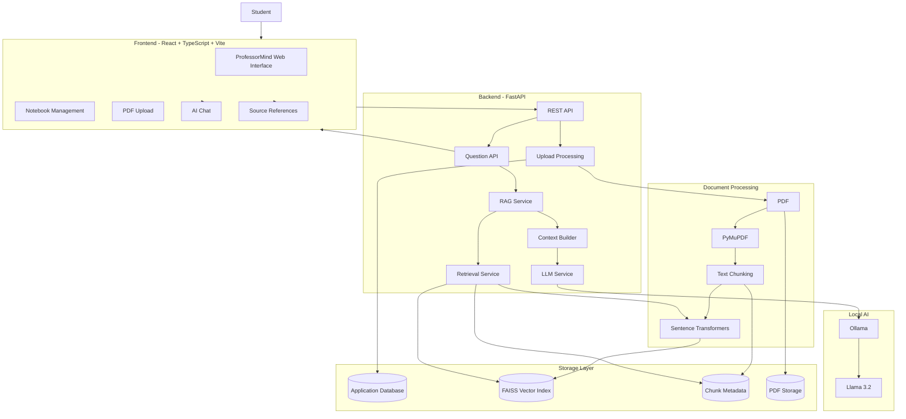

---

# End-to-End Workflow

The complete document and question workflow is:

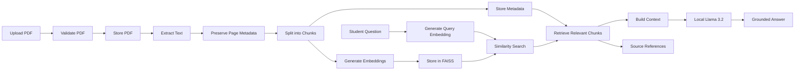

---

# Current RAG Pipeline

The currently implemented RAG pipeline can be represented as:

```text
PDF
 |
 v
PyMuPDF
 |
 v
Page-Level Text
 |
 v
Text Chunking
 |
 v
Sentence Transformer
 |
 v
Embeddings
 |
 v
FAISS
 |
 v
Question Embedding
 |
 v
Similarity Search
 |
 v
Relevant Chunks
 |
 v
Context Builder
 |
 v
Llama 3.2 via Ollama
 |
 v
Grounded Answer
 |
 v
Source References
```

---

# Retrieval-Augmented Generation

## What is RAG?

RAG stands for:

> **Retrieval-Augmented Generation**

RAG combines two major operations:

```text
Retrieval
    +
Generation
```

### Retrieval

The system searches an external knowledge source for information relevant to the user's question.

In ProfessorMind AI, this knowledge source is the student's uploaded academic material.

### Generation

The retrieved information is supplied to a language model, which generates a natural-language response.

---

# RAG Architecture

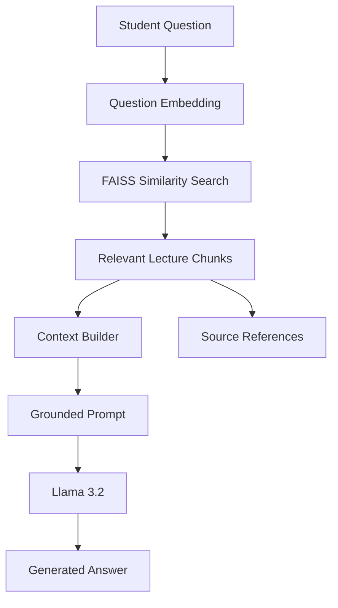

---

# PDF Ingestion Pipeline

The current document ingestion process begins with PDF processing.

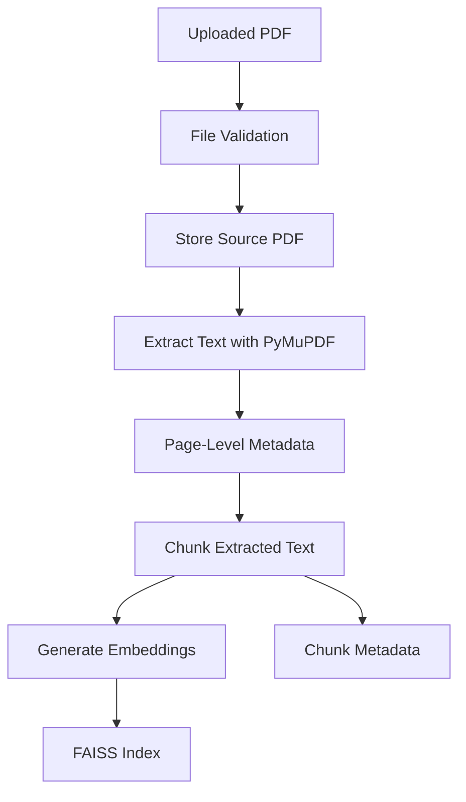

---

# Text Extraction

The current PDF processing implementation uses **PyMuPDF**.

The extraction process preserves page information.

Conceptually:

```text
PDF
 |
 +-- Page 1
 |     |
 |     +-- Extracted Text
 |
 +-- Page 2
 |     |
 |     +-- Extracted Text
 |
 +-- Page 3
       |
       +-- Extracted Text
```

Page information is important because the final system needs to identify the source location of retrieved information.

---

# Document Chunking

Large documents are not treated as one giant text block.

The extracted text is divided into smaller chunks.

```text
Document
   |
   +-- Chunk 1
   +-- Chunk 2
   +-- Chunk 3
   +-- Chunk 4
   +-- ...
```

Each chunk can be associated with metadata such as:

```text
file_id
filename
page_number
chunk_index
text
```

Chunking improves retrieval because the system can retrieve specific portions of a document instead of an entire document.

---

# Embeddings

An embedding converts text into a numerical vector representation.

Conceptually:

```text
"Gradient Descent"
        |
        v
[0.12, -0.45, 0.71, ...]
```

Semantically similar text tends to have similar vector representations.

ProfessorMind AI uses **Sentence Transformers** to generate embeddings.

The same embedding model is used for:

* Document chunks
* Student questions

This allows the system to compare the semantic representation of a question with stored academic content.

---

# FAISS Vector Search

FAISS is used as the vector similarity search engine.

FAISS stands for:

> **Facebook AI Similarity Search**

The system stores document embeddings in a FAISS index.

Conceptually:

```text
Document Chunk
      |
      v
Embedding Vector
      |
      v
FAISS Index
```

When a student asks a question:

```text
Question
   |
   v
Question Embedding
   |
   v
FAISS Similarity Search
   |
   v
Top Relevant Chunks
```

---

# FAISS Search Process

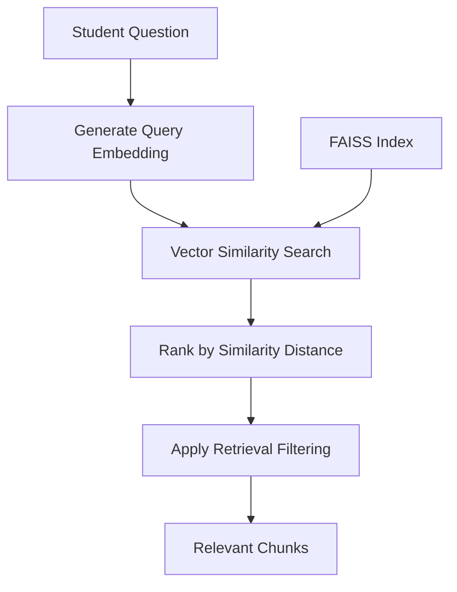

---

# Question Answering Pipeline

The question-answering process is:

```text
Student Question
       |
       v
Question API
       |
       v
Notebook Validation
       |
       v
RAG Service
       |
       v
Retrieval Service
       |
       v
Query Embedding
       |
       v
FAISS Search
       |
       v
Relevant Chunks
       |
       v
Context Builder
       |
       v
LLM Service
       |
       v
Ollama
       |
       v
Llama 3.2
       |
       v
Grounded Answer
       |
       v
Source References
```

---

# Context Construction

Retrieved chunks are prepared before being sent to the LLM.

A simplified representation is:

```text
--- Page 38 ---

Relevant lecture content...

--- Page 39 ---

Relevant lecture content...

--- Page 40 ---

Relevant lecture content...
```

The context-building layer is responsible for tasks such as:

* Normalizing retrieved chunks
* Removing duplicates
* Organizing retrieved content
* Preserving page information
* Preserving document metadata
* Creating structured LLM context

The exact implementation may vary depending on the current backend service logic.

---

# LLM Generation

The current LLM layer uses:

```text
FastAPI
   |
   v
Ollama
   |
   v
Llama 3.2
```

The model receives two major inputs:

```text
Student Question
        +
Retrieved Lecture Context
```

The goal is to generate an answer based on the retrieved academic material.

---

# Grounded Answering

ProfessorMind AI follows a grounding principle:

> **If the uploaded notes do not provide enough information to answer a question, the system should avoid inventing an answer from unrelated model knowledge.**

For an unsupported question, the system can return a response similar to:

```text
This question is outside the scope of the uploaded notes.
```

This behavior is important for academic reliability.

---

# Source References

Source information should originate from retrieval metadata rather than being invented by the LLM.

A conceptual source object may look like:

```json
{
  "file_id": "document-id",
  "filename": "lecture.pdf",
  "page_number": 38,
  "chunk_index": 157,
  "text": "Retrieved lecture content..."
}
```

A source list can contain:

```text
Sources

DEEP LEARNING.pdf
Page 38
Page 39
Page 81
```

The exact number of sources depends on the retrieved chunks.

---

# Why Source References Matter

Source references improve:

* Transparency
* Academic traceability
* Debugging
* User confidence
* Retrieval evaluation
* Answer verification

They also allow developers to inspect whether the retrieved context actually corresponds to the generated answer.

---

# Notebook Isolation

Each notebook represents a separate academic knowledge space.

Example:

```text
Notebook: Deep Learning
|
+-- Deep Learning.pdf
+-- CNN Notes.pdf
+-- RNN Notes.pdf
+-- Notebook FAISS Index
```

Another notebook may contain:

```text
Notebook: Machine Learning
|
+-- ML Notes.pdf
+-- Regression.pdf
+-- Classification.pdf
+-- Notebook FAISS Index
```

The retrieval process is scoped to the requested notebook.

This helps prevent unrelated notebook documents from becoming part of the retrieval context.

---

# Technology Stack

## Frontend

| Technology         | Purpose                             |
| ------------------ | ----------------------------------- |
| React              | User interface                      |
| TypeScript         | Type-safe frontend development      |
| Vite               | Frontend build and development tool |
| React Router       | Client-side routing                 |
| Tailwind CSS / CSS | UI styling                          |
| Lucide React       | Interface icons                     |

---

## Backend

| Technology | Purpose                   |
| ---------- | ------------------------- |
| Python     | Backend and AI processing |
| FastAPI    | REST API                  |
| Uvicorn    | ASGI server               |
| Pydantic   | Request validation        |
| SQLAlchemy | Database ORM              |

---

## AI / RAG

| Technology            | Purpose                  |
| --------------------- | ------------------------ |
| PyMuPDF               | PDF text extraction      |
| Sentence Transformers | Semantic text embeddings |
| FAISS                 | Vector similarity search |
| Ollama                | Local LLM runtime        |
| Llama 3.2             | Local language model     |

---

## Database / Storage

| Technology                       | Purpose                              |
| -------------------------------- | ------------------------------------ |
| SQLAlchemy                       | Database access layer                |
| PostgreSQL / configured database | Application metadata                 |
| FAISS                            | Vector index                         |
| Local file storage               | Uploaded PDF files                   |
| Metadata storage                 | Mapping chunks to source information |

> The exact database backend depends on the current project configuration.

---

# Project Architecture

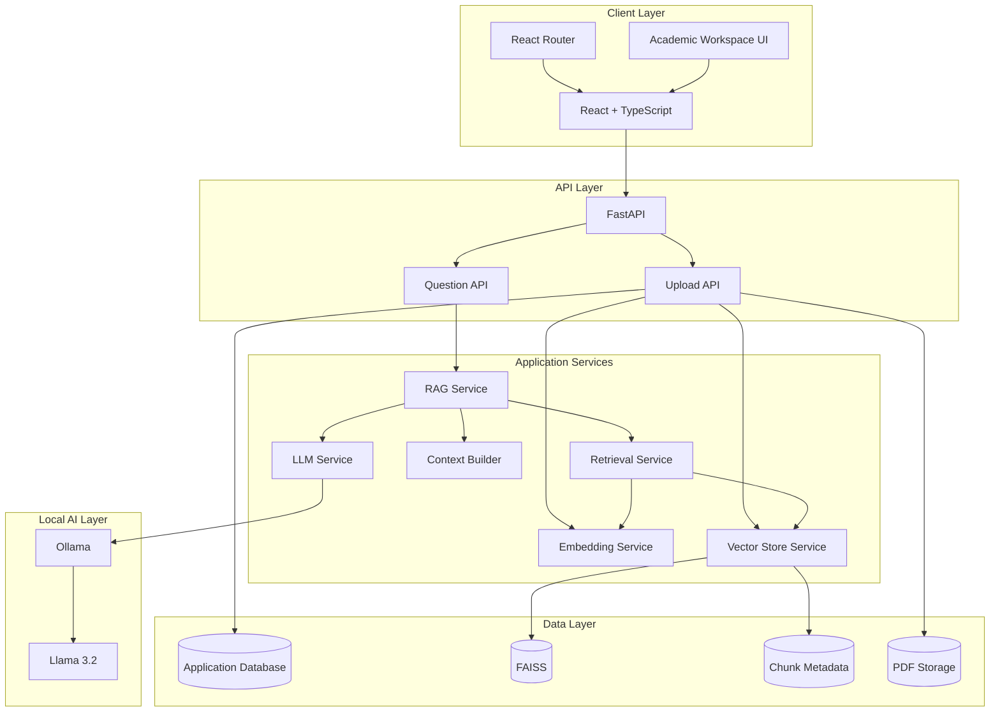

---

# Backend Architecture

The backend follows a modular service-oriented structure.

A simplified conceptual structure is:

```text
backend/
│
├── api/
│   ├── upload.py
│   └── question.py
│
├── services/
│   ├── rag_service.py
│   ├── retrieval_service.py
│   ├── context_builder.py
│   ├── embedding_service.py
│   ├── vector_store.py
│   └── llm_service.py
│
├── models/
│   ├── notebook.py
│   └── document.py
│
├── database.py
│
└── main.py
```

> This is a conceptual representation. Always treat the actual repository structure as the source of truth.

---

# Backend Service Responsibilities

## Upload API

The upload layer is responsible for operations such as:

* Receiving PDF files
* Validating uploaded files
* Creating document records
* Storing source PDFs
* Extracting text
* Chunking text
* Generating embeddings
* Updating the FAISS index
* Updating document processing status

---

## Question API

The question endpoint is responsible for:

* Validating the notebook
* Receiving the student's question
* Validating request parameters
* Calling the RAG service
* Returning the generated answer
* Returning source references
* Handling API errors

---

## RAG Service

The RAG service coordinates:

```text
Retrieval
    +
Context Construction
    +
LLM Generation
```

It acts as the main orchestration layer for question answering.

---

## Retrieval Service

The retrieval service is responsible for:

* Loading the relevant notebook FAISS index
* Creating the question embedding
* Running similarity search
* Retrieving relevant chunks
* Returning retrieval metadata

---

## Context Builder

The context builder is responsible for:

* Cleaning retrieved content
* Removing duplicates where appropriate
* Organizing retrieved chunks
* Preserving metadata
* Building LLM-ready context

---

## Embedding Service

The embedding service is responsible for generating vector representations for:

* Document chunks
* User questions

The same compatible embedding model should be used for both document and query embeddings.

---

## Vector Store Service

The vector store layer can be responsible for:

* Loading FAISS indexes
* Searching FAISS
* Saving indexes
* Loading metadata
* Maintaining vector/metadata alignment

---

## LLM Service

The LLM service is responsible for:

* Connecting to Ollama
* Selecting the configured Llama model
* Constructing the grounded prompt
* Generating the answer
* Applying appropriate response handling

---

# Frontend Architecture

The frontend is built with React, TypeScript, and Vite.

Conceptually:

```text
frontend/
│
├── src/
│   ├── components/
│   ├── pages/
│   ├── services/
│   ├── types/
│   ├── App.tsx
│   └── main.tsx
│
├── public/
│
├── package.json
└── vite.config.ts
```

---

# Frontend Responsibilities

The frontend provides the user-facing academic workspace.

Major responsibilities include:

* Dashboard
* Notebook management
* Document management
* PDF upload
* AI chat
* Source reference display
* Navigation
* Loading states
* Error states
* API communication

---

# Database Architecture

The application database stores structured application-level information.

Conceptually:

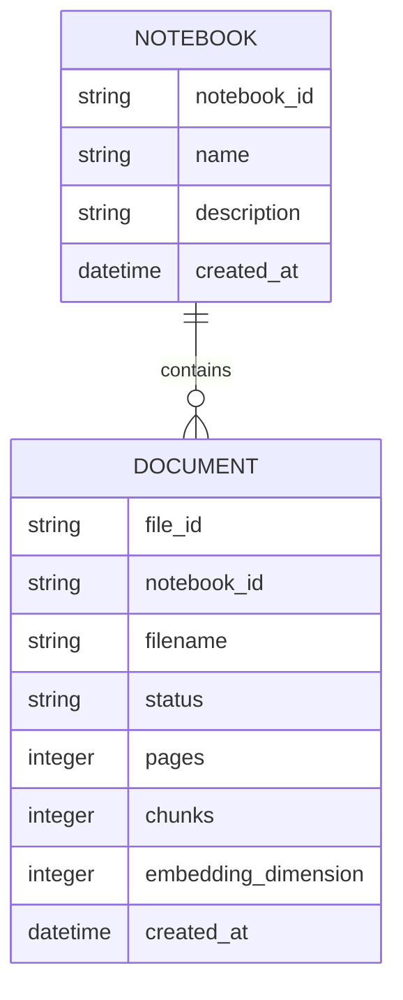

The database manages application metadata while FAISS handles vector similarity search.

---

# Storage Architecture

The system separates different types of data:

```text
Application Metadata
        |
        v
Application Database

Vector Data
        |
        v
FAISS

Source Documents
        |
        v
Local File Storage

Chunk Metadata
        |
        v
Metadata Storage
```

This separation keeps responsibilities clear.

---

# API Reference

## Ask Question

### Endpoint

```text
POST /api/ask
```

### Purpose

Ask a question against a specific notebook.

---

## Request Example

```json
{
  "notebook_id": "notebook-id",
  "question": "What are the three types of Gradient Descent mentioned in the notes?"
}
```

---

## Request with `top_k`

```json
{
  "notebook_id": "notebook-id",
  "question": "Explain stochastic gradient descent.",
  "top_k": 5
}
```

> The exact accepted request fields and validation rules should always match the current backend implementation.

---

# API Request Validation

The question endpoint should validate items such as:

* Notebook ID
* Question presence
* Question length
* Retrieval parameters
* Valid `top_k` range

The purpose of validation is to prevent malformed requests from reaching the retrieval and generation layers.

---

# API Response Structure

A successful response can follow a structure similar to:

```json
{
  "question": "What are the three types of Gradient Descent mentioned in the notes?",
  "answer": "The notes describe Batch Gradient Descent, Stochastic Gradient Descent, and Mini-batch Gradient Descent.",
  "sources": [
    {
      "file_id": "document-id",
      "filename": "lecture.pdf",
      "page_number": 39,
      "chunk_index": 159,
      "text": "Retrieved lecture content..."
    }
  ]
}
```

The exact response structure depends on the current backend implementation.

---

# HTTP Status Codes

Typical API responses may include:

| Status | Meaning                  |
| -----: | ------------------------ |
|    200 | Successful request       |
|    400 | Invalid request          |
|    404 | Resource not found       |
|    422 | Validation error         |
|    500 | Unexpected backend error |

---

# Environment Setup

## Prerequisites

Before running the project, install the following:

* Python 3.12
* Node.js
* npm
* Git
* Ollama

The required Llama model should also be available locally.

---

# Backend Setup

## 1. Open the Project Root

```powershell
cd "D:\Collage Project\ProfessorMindAI"
```

Replace the path if the project is stored elsewhere.

---

## 2. Create Virtual Environment

```powershell
python -m venv .venv-clean
```

---

## 3. Activate Virtual Environment

For Windows PowerShell:

```powershell
.\.venv-clean\Scripts\Activate.ps1
```

After activation, the terminal should show the environment name, for example:

```text
(.venv-clean) PS D:\Collage Project\ProfessorMindAI>
```

---

## 4. Install Backend Dependencies

```powershell
pip install -r requirements.txt
```

---

## 5. Verify Python

```powershell
python --version
```

Recommended project environment:

```text
Python 3.12.x
```

---

# Frontend Setup

Open another terminal.

Move into the frontend directory:

```powershell
cd frontend
```

Install dependencies:

```powershell
npm install
```

---

# Ollama Setup

ProfessorMind AI uses Ollama for local LLM inference.

Verify Ollama:

```powershell
ollama --version
```

Check installed models:

```powershell
ollama list
```

The current project uses:

```text
llama3.2
```

If the model is not installed:

```powershell
ollama pull llama3.2
```

Test the model:

```powershell
ollama run llama3.2
```

---

# Running the Application

The frontend and backend run independently.

A typical local development setup uses:

```text
Frontend
http://localhost:5173

Backend
http://127.0.0.1:8001

Ollama
Local Ollama service
```

---

# Start Backend

From the project root:

```powershell
.\.venv-clean\Scripts\Activate.ps1
```

Then start FastAPI:

```powershell
python -m uvicorn backend.main:app --host 127.0.0.1 --port 8001
```

Backend address:

```text
http://127.0.0.1:8001
```

FastAPI Swagger documentation:

```text
http://127.0.0.1:8001/docs
```

FastAPI ReDoc:

```text
http://127.0.0.1:8001/redoc
```

---

# Start Frontend

Open another terminal:

```powershell
cd frontend
```

Run:

```powershell
npm run dev
```

Vite normally starts at:

```text
http://localhost:5173/
```

The exact port can change if another service is already using the default Vite port.

---

# Application Runtime

The local runtime can be visualized as:

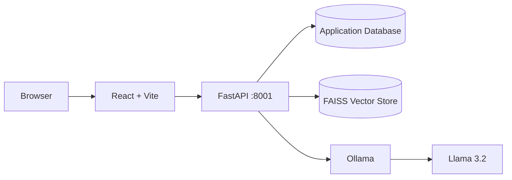

---

# Project Directory Structure

A simplified conceptual project structure is:

```text
ProfessorMindAI/
│
├── backend/
│   ├── api/
│   │   ├── upload.py
│   │   └── question.py
│   │
│   ├── models/
│   │   ├── notebook.py
│   │   └── document.py
│   │
│   ├── services/
│   │   ├── context_builder.py
│   │   ├── embedding_service.py
│   │   ├── llm_service.py
│   │   ├── rag_service.py
│   │   ├── retrieval_service.py
│   │   └── vector_store.py
│   │
│   ├── database.py
│   └── main.py
│
├── frontend/
│   ├── src/
│   │   ├── components/
│   │   ├── pages/
│   │   ├── services/
│   │   ├── types/
│   │   ├── App.tsx
│   │   └── main.tsx
│   │
│   ├── package.json
│   └── vite.config.ts
│
├── storage/
│   └── notebooks/
│
├── requirements.txt
├── .gitignore
└── README.md
```

> The actual repository structure is the final authority. This section documents the intended architecture.

---

# Data Flow

## Document Flow

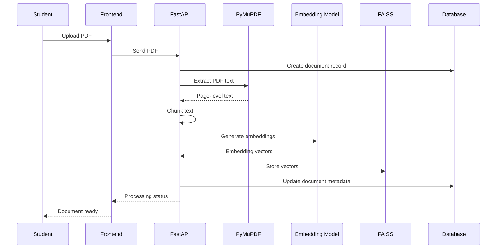

---

# Question Flow

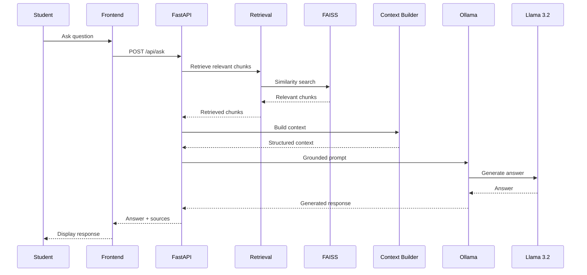

---

# Retrieval Strategy

The retrieval process is based on vector similarity.

The general flow is:

```text
Question
   |
   v
Question Embedding
   |
   v
FAISS Similarity Search
   |
   v
Candidate Chunks
   |
   v
Distance / Relevance Filtering
   |
   v
Retrieved Context
```

The goal is not simply to retrieve as many chunks as possible.

The goal is to retrieve the most useful context for answering the question.

---

# Retrieval Parameters

The question API can support a `top_k` retrieval parameter.

Example:

```json
{
  "notebook_id": "notebook-id",
  "question": "Explain stochastic gradient descent.",
  "top_k": 5
}
```

Conceptually:

```text
top_k = number of candidate chunks retrieved
```

A larger value may:

* Increase context coverage
* Include additional supporting information
* Increase irrelevant context
* Increase prompt size

A smaller value may:

* Produce more focused context
* Reduce prompt size
* Miss useful supporting information

Therefore, retrieval parameters should be evaluated using actual academic questions.

---

# Retrieval Evaluation

Retrieval quality should be evaluated separately from answer quality.

A model may sometimes generate a plausible answer even when retrieval contains noise.

Evaluation should therefore consider:

1. Retrieved pages
2. Retrieved chunk relevance
3. Similarity distances
4. Answer correctness
5. Unsupported claims
6. Source references
7. Notebook isolation
8. Retrieval consistency

---

# Retrieval Experimentation

Example evaluation questions:

```text
Q1:
What are the three types of Gradient Descent mentioned in the notes?

Q2:
What do the notes say about Stochastic Gradient Descent?

Q3:
Explain the XOR problem and its solution using a Multi-Layer Perceptron, including the example for X1 = 0 and X2 = 0.

Q4:
What is the learning rate value used for Gradient Descent in the notes?

Q5:
What is quantum computing?
```

These questions can test different retrieval behaviors.

---

# Evaluation Categories

## Supported Question

The required information exists in the uploaded lecture material.

Expected behavior:

```text
Retrieve relevant chunks
        |
        v
Generate grounded answer
        |
        v
Return sources
```

---

## Unsupported Question

The required information does not exist in the uploaded material.

Expected behavior:

```text
No sufficiently relevant evidence
        |
        v
Do not fabricate
        |
        v
Return scope / insufficient-context response
```

---

# Testing

Testing should be performed at multiple levels.

Recommended levels include:

```text
Syntax
  |
  v
Build
  |
  v
API
  |
  v
Document Processing
  |
  v
Retrieval
  |
  v
LLM Generation
  |
  v
End-to-End Workflow
```

---

# Backend Syntax Validation

Python files can be compiled without starting the complete application.

Example:

```powershell
python -m py_compile backend/services/vector_store.py backend/services/context_builder.py backend/services/rag_service.py backend/services/llm_service.py
```

If the command completes without an error, the specified Python files passed basic syntax compilation.

---

# Frontend Build

From the frontend directory:

```powershell
npm run build
```

This validates the production frontend build.

---

# Git Validation

Check repository changes:

```powershell
git status
```

Check whitespace and patch formatting:

```powershell
git diff --check
```

---

# Functional Testing

## Test 1 — PDF Upload

Verify:

* PDF is accepted
* Document record is created
* Text is extracted
* Pages are processed
* Chunks are generated
* Embeddings are generated
* FAISS index is updated
* Metadata is stored
* Document processing reaches the correct final status

---

## Test 2 — Supported Question

Ask a question clearly covered by the lecture notes.

Verify:

* Successful API response
* Correct answer
* Relevant sources
* Correct filename
* Correct page references
* Correct notebook scope

---

## Test 3 — Unsupported Question

Ask a question outside the uploaded notes.

Verify:

* The system does not fabricate unsupported academic information
* The response indicates insufficient scope or evidence
* Sources are empty or appropriately absent

---

## Test 4 — Notebook Isolation

Create two notebooks with different documents.

Example:

```text
Notebook A
  -> Deep Learning.pdf

Notebook B
  -> Database Systems.pdf
```

Ask a Deep Learning question against Notebook A.

Verify that Notebook B's document is not included in retrieval.

---

## Test 5 — Source Integrity

Verify that returned sources contain metadata such as:

```text
file_id
filename
page_number
chunk_index
```

Verify that these values originate from backend retrieval metadata.

---

# Failure Handling

The backend should handle common failures such as:

* Missing notebook
* Missing FAISS index
* Missing metadata
* Invalid request
* Empty question
* Invalid retrieval configuration
* Invalid file
* PDF processing failure
* Embedding failure
* LLM connection failure
* Unexpected backend errors

---

# Upload Failure Handling

If document processing fails, the backend should:

1. Mark the document as failed when supported.
2. Log the error.
3. Avoid returning a false success state.
4. Clean up temporary files when appropriate.
5. Return an appropriate API error.

---

# Retrieval Failure Handling

If the required FAISS index or metadata is unavailable, the system should not silently generate a fabricated academic answer.

The API should return a clear error or insufficient-context response depending on the failure type.

---

# Vector / Metadata Integrity

FAISS vector positions and metadata positions must remain correctly aligned.

Conceptually:

```text
FAISS Position 0
       |
       +----> Metadata Position 0

FAISS Position 1
       |
       +----> Metadata Position 1

FAISS Position 2
       |
       +----> Metadata Position 2
```

If these structures become misaligned, source references may point to incorrect documents or pages.

Therefore, the vector store should maintain and validate the relationship between:

```text
Vector
   <-> 
Chunk
   <->
Source Metadata
```

---

# Security Considerations

ProfessorMind AI is an academic knowledge system, so security should be considered at multiple layers.

Important considerations include:

* File type validation
* Upload size limits
* Input validation
* Notebook-level isolation
* Authentication in production
* Authorization checks
* Secure file storage
* Environment variable protection
* Secret management
* Avoiding credentials in source code
* Avoiding unnecessary external data transmission
* API rate limiting in production

---

# Environment Variables

Environment-specific configuration should not be committed to Git.

Example:

```text
.env
```

should normally be excluded through `.gitignore`.

Never commit:

```text
API keys
Database passwords
Authentication secrets
Private tokens
Credentials
```

A safe configuration approach is:

```text
Application
    |
    v
Environment Variables
    |
    v
Runtime Configuration
```

---

# Privacy

The current architecture uses a local LLM through Ollama.

The intended local inference flow is:

```text
Student Document
       |
       v
Local Backend
       |
       v
Local Vector Store
       |
       v
Local Ollama
       |
       v
Local Llama 3.2
```

This reduces the need to send private academic document content to an external hosted LLM provider for generation.

However, privacy also depends on:

* Where files are stored
* Who can access the machine
* Application authentication
* API authorization
* Database configuration
* Production deployment architecture

---

# Current Implementation Status

## Implemented

The current project includes the following major capabilities:

* React frontend
* TypeScript frontend
* Vite development environment
* FastAPI backend
* Notebook-based organization
* PDF upload
* PDF text extraction
* Page-level metadata
* Text chunking
* Sentence Transformer embeddings
* FAISS vector storage
* Semantic retrieval
* RAG orchestration
* Context construction
* Local Ollama integration
* Llama 3.2 inference
* Grounded answering
* Source metadata
* Page references
* Basic unsupported-question handling
* Backend error handling
* Frontend chat interface
* Document management workflow

---

# Current Document Ingestion Scope

The current ingestion pipeline is primarily PDF text-based:

```text
PDF
 |
 v
Text Extraction
 |
 v
Page Metadata
 |
 v
Chunking
 |
 v
Embedding
 |
 v
FAISS
```

The system is architected so additional document modalities can be introduced later.

---

# Known Limitations

## 1. PDF Text Dependency

The current ingestion pipeline primarily depends on extractable PDF text.

Scanned PDFs may require OCR.

---

## 2. Retrieval Noise

Semantic similarity does not guarantee that every retrieved chunk is perfectly relevant.

A chunk may contain related terminology without directly answering the question.

Therefore, retrieval parameters require evaluation and tuning.

---

## 3. Context Window

The LLM has a finite context capacity.

Retrieving too many chunks can introduce:

* Noise
* Redundancy
* Longer prompts
* Less focused answers

---

## 4. Answer Quality Depends on Retrieval

RAG quality can be understood conceptually as:

```text
Retrieval Quality
        +
Context Quality
        +
Prompt Quality
        +
LLM Quality
        =
Answer Quality
```

If retrieval fails, even a strong LLM may not produce the desired academic answer.

---

## 5. OCR

OCR for scanned documents is future scope unless separately implemented.

---

## 6. Local Inference Hardware

Local LLM inference depends on available CPU, RAM, GPU, and storage resources.

Larger models may require significantly more resources.

---

# Future Scope

Potential future improvements include:

* OCR for scanned PDFs
* PowerPoint ingestion
* DOCX ingestion
* Image understanding
* Lecture audio processing
* Video processing
* Speech-to-text
* Multimodal retrieval
* Hybrid keyword + semantic search
* Reranking
* Improved citation extraction
* Authentication
* Role-based access control
* Cloud deployment
* Background document processing
* Redis caching
* Celery or task queues
* Docker deployment
* Kubernetes deployment
* Monitoring
* Evaluation dashboards
* Automated RAG benchmarks
* Better retrieval evaluation
* Conversation memory
* Personalized learning workflows

---

# Multimodal Expansion

The project vision includes multimodal academic learning assistance.

However, the current implementation is primarily focused on PDF text processing.

A future multimodal architecture could be:

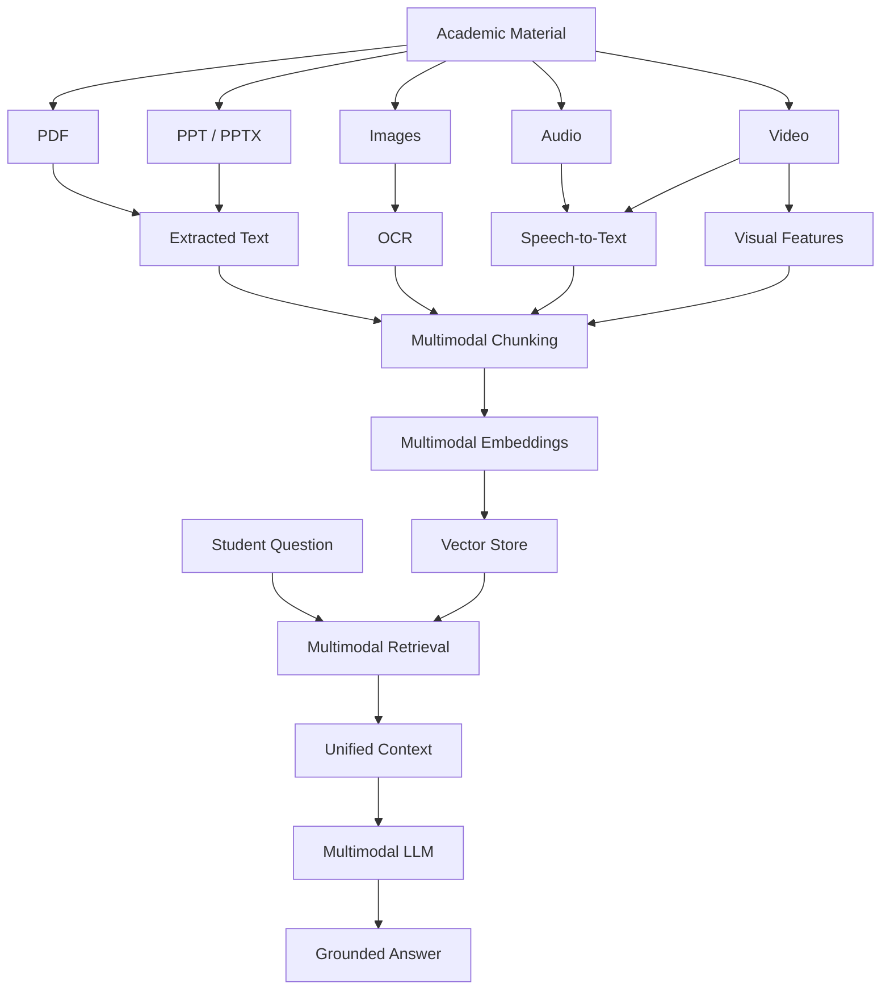

This diagram represents **future architecture**, not the current implementation.

---

# Performance Considerations

The major performance-sensitive stages are:

```text
PDF Processing
       |
       v
Embedding Generation
       |
       v
FAISS Search
       |
       v
Context Construction
       |
       v
LLM Inference
```

In local RAG systems, LLM inference can become a major latency component.

Performance can be improved through:

* Efficient chunking
* Appropriate embedding models
* FAISS indexing strategies
* Retrieval tuning
* Context reduction
* Prompt optimization
* GPU acceleration
* Caching
* Background document processing
* Batch embedding
* Better resource management

---

# Design Principles

ProfessorMind AI follows several engineering principles.

## 1. Grounding First

Answers should be based on retrieved academic evidence whenever possible.

---

## 2. No Unnecessary Fabrication

If the uploaded material does not provide sufficient evidence, the system should avoid presenting unsupported information as if it came from the notes.

---

## 3. Source Traceability

Retrieved information should remain connected to its source metadata.

---

## 4. Notebook Isolation

Knowledge belonging to one notebook should not unintentionally affect another notebook.

---

## 5. Modular Architecture

Services should be separated according to responsibility.

---

## 6. Local-First AI

The current system uses local LLM inference through Ollama.

---

## 7. Future Extensibility

The architecture should allow future multimodal and production capabilities.

---

# Why RAG?

A standard LLM contains general pretrained knowledge.

However, a student's lecture material may contain:

* Professor-specific explanations
* Custom examples
* Course-specific terminology
* Course-specific definitions
* Specific page references
* Unique lecture content
* Important formulas
* Exam-oriented explanations

RAG allows the system to retrieve this information before generating an answer.

Conceptually:

```text
General LLM Knowledge
        +
Private Academic Knowledge
        |
        v
Grounded Academic Assistant
```

---

# Why FAISS?

FAISS is suitable for the current project because it provides efficient vector similarity search.

Advantages include:

* Fast vector search
* Local execution
* Open-source ecosystem
* Python integration
* Semantic retrieval support
* No mandatory external vector database
* Suitable for local experimentation

For the current project scale, FAISS provides a practical local vector search layer.

---

# Why Local LLM?

Using a local LLM provides several benefits:

* Reduced dependence on external APIs
* Better local privacy control
* Offline/local experimentation
* No per-request cloud inference cost
* Easier academic experimentation

The main trade-off is that local inference depends on available hardware.

---

# Why Ollama?

Ollama provides a convenient runtime for local language models.

The application can communicate with Ollama through its local service/API.

Architecture:

```text
FastAPI
   |
   v
Ollama
   |
   v
Llama 3.2
```

This keeps the LLM integration relatively simple and modular.

---

# Why Sentence Transformers?

Sentence Transformers provide models for converting text into semantic vector representations.

They are useful for semantic retrieval because:

```text
Question
   |
   v
Embedding
   |
   v
Semantic Similarity
   |
   v
Relevant Document Chunks
```

This is more appropriate for semantic retrieval than relying only on exact string matching.

---

# Advantages

## Academic Focus

The system is designed specifically around academic lecture knowledge.

## Private Knowledge Retrieval

Students can query their own uploaded documents.

## Semantic Search

Conceptual similarity can be used instead of only keyword matching.

## Local AI

The current LLM inference runs locally through Ollama.

## Source References

Retrieved page and document metadata improve traceability.

## Modular Architecture

The system can evolve into a larger multimodal platform.

## Extensibility

Future capabilities can be added without redesigning the entire application.

---

# Challenges

## Retrieval Accuracy

Finding the correct chunks is one of the most important RAG challenges.

---

## Chunking

Chunks must contain enough information without becoming unnecessarily large.

---

## Context Noise

Retrieving too much information can reduce answer quality.

---

## Hallucination Control

The model should remain grounded in the retrieved context.

---

## Source Integrity

Metadata must remain correctly aligned with vector positions.

---

## Local Inference

LLM performance depends on available hardware.

---

## Document Diversity

PDFs can have very different layouts and extraction quality.

---

# Use Cases

ProfessorMind AI can be used for:

* Lecture revision
* Exam preparation
* Concept explanation
* Quick document search
* Course-specific Q&A
* Professor-specific notes
* Academic document exploration
* Assignment preparation
* Research material exploration
* Revision assistance
* Topic discovery

---

# Academic Value

The project demonstrates the integration of several modern AI concepts:

```text
Artificial Intelligence
        |
        +-- Natural Language Processing
        |
        +-- Embeddings
        |
        +-- Vector Search
        |
        +-- Retrieval-Augmented Generation
        |
        +-- Large Language Models
        |
        +-- Local AI
```

It also combines these concepts with software engineering:

```text
Software Engineering
        |
        +-- React
        +-- TypeScript
        +-- FastAPI
        +-- Python
        +-- REST APIs
        +-- Databases
        +-- File Storage
        +-- Modular Architecture
```

---

# Engineering Value

ProfessorMind AI is not simply an LLM chatbot.

It demonstrates a complete AI application pipeline:

```text
Frontend
   |
   v
REST API
   |
   v
Document Processing
   |
   v
Embeddings
   |
   v
Vector Search
   |
   v
Retrieval
   |
   v
Context Engineering
   |
   v
Local LLM
   |
   v
Grounded Response
   |
   v
Source References
```

The project therefore combines:

```text
Full-Stack Development
        +
AI Engineering
        +
RAG
        +
Vector Search
        +
Local LLM
        +
Document Processing
```

---

# Viva Explanation

## 30-Second Explanation

ProfessorMind AI is a professor-centric academic learning assistant based on Retrieval-Augmented Generation.

Students upload lecture PDFs into notebooks. The system extracts PDF text using PyMuPDF, divides the text into chunks, converts the chunks into embeddings using Sentence Transformers, and stores them in FAISS.

When a student asks a question, the question is converted into an embedding and searched against the relevant notebook's FAISS index.

The most relevant chunks are passed to a local Llama 3.2 model running through Ollama.

The model generates a grounded answer using the retrieved lecture material, while the system also returns source metadata such as the document name and page number.

---

# 1-Minute Technical Explanation

ProfessorMind AI follows a Retrieval-Augmented Generation architecture.

During document ingestion, a PDF is uploaded through the React frontend and sent to the FastAPI backend.

The backend extracts page-level text using PyMuPDF.

The extracted content is split into chunks and converted into numerical embeddings using a Sentence Transformer model.

These embeddings are stored in a notebook-specific FAISS vector index, while document and chunk metadata are stored separately.

When the user asks a question, the question is embedded using the same embedding model.

FAISS performs similarity search to identify relevant lecture chunks.

The retrieved chunks are passed through a context builder, which organizes the retrieved information.

The resulting context is provided to a locally running Llama 3.2 model through Ollama.

The model generates an answer based on the retrieved context.

Source metadata is returned separately so that the frontend can display the relevant document and page references.

---

# Common Viva Questions

## Q1. What is RAG?

RAG stands for Retrieval-Augmented Generation.

It retrieves relevant information from an external knowledge source and provides that information to an LLM before generating an answer.

---

## Q2. Why did you use RAG?

RAG allows the system to answer using private academic documents instead of relying only on the LLM's pretrained knowledge.

---

## Q3. What is FAISS?

FAISS is a library designed for efficient similarity search over vector representations.

---

## Q4. What is an embedding?

An embedding is a numerical vector representation of information that captures semantic relationships.

---

## Q5. Why use embeddings?

Embeddings allow the system to compare the semantic meaning of a question with the semantic meaning of document chunks.

---

## Q6. Why use Sentence Transformers?

Sentence Transformers provide models that can convert text into semantic vector representations suitable for similarity search.

---

## Q7. Why use Llama 3.2?

Llama 3.2 provides the language-generation capability required to transform retrieved academic context into a natural-language answer.

---

## Q8. Why use Ollama?

Ollama provides a convenient local runtime for running language models.

---

## Q9. Why not directly ask the LLM?

A direct LLM request may rely heavily on pretrained knowledge and may produce unsupported information.

RAG first retrieves relevant academic evidence.

---

## Q10. What happens if the answer is not present in the notes?

The system is designed to avoid presenting unsupported information as if it came from the uploaded academic material and can return an insufficient-context or out-of-scope response.

---

## Q11. What is chunking?

Chunking divides large documents into smaller pieces that can be embedded, searched, and supplied to the LLM efficiently.

---

## Q12. What is semantic search?

Semantic search retrieves content based on meaning rather than only exact keyword matches.

---

## Q13. What is notebook isolation?

Notebook isolation means retrieval is restricted to the selected notebook's knowledge space.

---

## Q14. What is the role of FastAPI?

FastAPI provides the backend REST API connecting the frontend with document processing, retrieval, and LLM services.

---

## Q15. What is the role of React?

React provides the interactive user interface through which students manage notebooks, upload documents, and ask questions.

---

## Q16. Why preserve page numbers?

Page numbers make retrieved information traceable back to the original lecture material.

---

## Q17. What is the role of FAISS metadata?

Metadata connects a retrieved vector position back to the original document, page, chunk, and text.

---

## Q18. What happens during PDF upload?

The system validates the PDF, stores it, extracts text, creates chunks, generates embeddings, updates the vector index, and stores relevant metadata.

---

## Q19. What is hallucination?

Hallucination occurs when an AI model generates information that is unsupported, incorrect, or not grounded in the available evidence.

---

## Q20. How does your project reduce hallucination?

The project uses retrieval first and provides retrieved academic context to the LLM. It also uses a grounding-oriented prompt and can reject unsupported questions.

---

# Useful Commands

## Activate Backend Environment

```powershell
.\.venv-clean\Scripts\Activate.ps1
```

---

## Start Backend

```powershell
python -m uvicorn backend.main:app --host 127.0.0.1 --port 8001
```

---

## Start Frontend

```powershell
cd frontend
npm run dev
```

---

## Build Frontend

```powershell
cd frontend
npm run build
```

---

## Install Frontend Dependencies

```powershell
cd frontend
npm install
```

---

## Install Backend Dependencies

```powershell
pip install -r requirements.txt
```

---

## Validate Python Files

```powershell
python -m py_compile backend/services/vector_store.py backend/services/context_builder.py backend/services/rag_service.py backend/services/llm_service.py
```

---

## Check Git Status

```powershell
git status
```

---

## Check Git Formatting Errors

```powershell
git diff --check
```

---

## Check Ollama

```powershell
ollama list
```

---

## Pull Llama 3.2

```powershell
ollama pull llama3.2
```

---

## Run Llama 3.2

```powershell
ollama run llama3.2
```

---

# Development Workflow

Recommended development workflow:

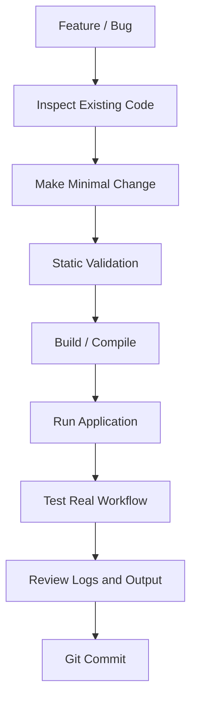

The preferred development approach is:

1. Understand the existing implementation.
2. Identify the exact failure or requirement.
3. Make the smallest appropriate change.
4. Validate syntax.
5. Build the application.
6. Run the affected workflow.
7. Test the real user flow.
8. Review logs and output.
9. Commit only verified changes.

---

# Troubleshooting

## Backend Does Not Start

Check Python:

```powershell
python --version
```

Activate the environment:

```powershell
.\.venv-clean\Scripts\Activate.ps1
```

Then:

```powershell
python -m uvicorn backend.main:app --host 127.0.0.1 --port 8001
```

If the backend still fails, inspect the first meaningful traceback/error rather than only the final line.

---

# Ollama Is Not Responding

Check Ollama:

```powershell
ollama list
```

Check the model:

```powershell
ollama run llama3.2
```

Make sure the Ollama service is running locally.

---

# Frontend Does Not Start

Run:

```powershell
cd frontend
npm install
npm run dev
```

If the frontend reports dependency errors, inspect the first package or TypeScript error.

---

# Frontend Build Fails

Run:

```powershell
cd frontend
npm run build
```

Read the first actual TypeScript/Vite error instead of assuming later errors are independent.

---

# RAG Returns Poor Results

Check:

1. Whether the correct notebook is being queried.
2. Whether the PDF was successfully processed.
3. Whether chunks were generated.
4. Whether embeddings were generated.
5. Whether FAISS contains vectors.
6. Whether metadata is aligned with vectors.
7. Whether retrieved chunks are relevant.
8. Whether `top_k` is appropriate.
9. Whether context construction introduces unnecessary content.
10. Whether the LLM prompt is grounded.
11. Whether the question is actually covered by the document.

---

# RAG Debugging Strategy

When an answer is incorrect, do not immediately change the LLM prompt.

Debug in this order:

```text
1. User Question
       |
       v
2. Query Embedding
       |
       v
3. FAISS Retrieval
       |
       v
4. Retrieved Chunks
       |
       v
5. Similarity / Distance
       |
       v
6. Context
       |
       v
7. LLM Prompt
       |
       v
8. Generated Answer
       |
       v
9. Source References
```

This helps identify the actual failure layer.

---

# Responsible AI Considerations

ProfessorMind AI should be treated as an academic assistance system rather than an unquestionable authority.

Important considerations include:

* Answers should be checked against source material.
* Unsupported questions should not be fabricated.
* Retrieval quality should be evaluated.
* Source references should remain traceable.
* User documents should be protected.
* Production deployments should implement authentication.
* Production deployments should implement authorization.
* Sensitive academic documents should not be exposed unnecessarily.
* AI-generated answers should not automatically be treated as academically authoritative.

---

# Future Production Architecture

A production-scale version could evolve toward:

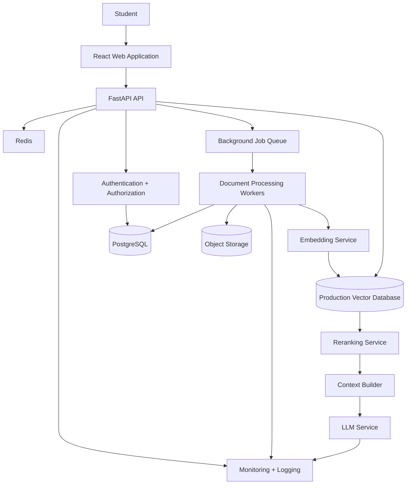

This is future architecture and is **not the current local deployment architecture**.

---

# Potential Production Improvements

## Authentication

Users should have secure accounts.

---

## Authorization

Users should only access their own notebooks and documents.

---

## Object Storage

Uploaded documents can eventually be moved from local storage to secure object storage.

---

## Background Processing

Large documents should be processed asynchronously so that the API remains responsive.

---

## Redis

Redis can be introduced for:

* Caching
* Rate limiting
* Temporary state
* Session-related data
* Frequently requested results

---

## Reranking

A reranking model can improve retrieval quality by evaluating the relevance of initially retrieved chunks.

Potential future pipeline:

```text
FAISS Top-K
    |
    v
Reranker
    |
    v
Best Chunks
    |
    v
Context Builder
    |
    v
LLM
```

---

# Retrieval Improvement Roadmap

A future retrieval pipeline could become:

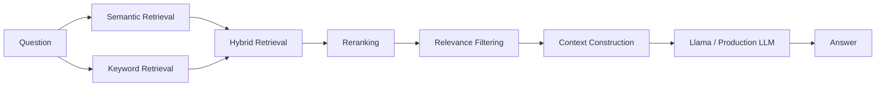

Hybrid retrieval can be particularly useful for academic queries containing exact technical terminology.

---

# Engineering Principles

The project emphasizes:

```text
Correctness
     +
Traceability
     +
Modularity
     +
Privacy
     +
Maintainability
     +
Extensibility
```

A feature should not only work.

It should also be:

* Understandable
* Testable
* Maintainable
* Debuggable
* Extendable

---

# Project Status

## Current Status

| Component                 | Status       |
| ------------------------- | ------------ |
| React Frontend            | Implemented  |
| TypeScript                | Implemented  |
| Vite                      | Implemented  |
| FastAPI Backend           | Implemented  |
| PDF Upload                | Implemented  |
| PDF Text Extraction       | Implemented  |
| Page Metadata             | Implemented  |
| Text Chunking             | Implemented  |
| Embeddings                | Implemented  |
| FAISS Retrieval           | Implemented  |
| RAG Pipeline              | Implemented  |
| Context Construction      | Implemented  |
| Ollama Integration        | Implemented  |
| Llama 3.2                 | Implemented  |
| Grounded Answering        | Implemented  |
| Source References         | Implemented  |
| Notebook Isolation        | Implemented  |
| Multimodal Ingestion      | Future Scope |
| OCR                       | Future Scope |
| PPT Processing            | Future Scope |
| Audio / Video             | Future Scope |
| Production Authentication | Future Scope |
| Cloud Deployment          | Future Scope |
| Advanced Reranking        | Future Scope |
| Hybrid Search             | Future Scope |

---

# Project Vision

The long-term vision of ProfessorMind AI is to evolve from a PDF-focused academic assistant into a complete private multimodal learning environment.

The future system could understand:

```text
PDF
PPT
Images
Lecture Audio
Lecture Video
Handwritten Notes
Diagrams
Tables
Assignments
Research Papers
```

and provide:

```text
Search
    +
Question Answering
    +
Summarization
    +
Source Retrieval
    +
Concept Explanation
    +
Revision Assistance
    +
Multimodal Knowledge Retrieval
```

---

# Final System Vision

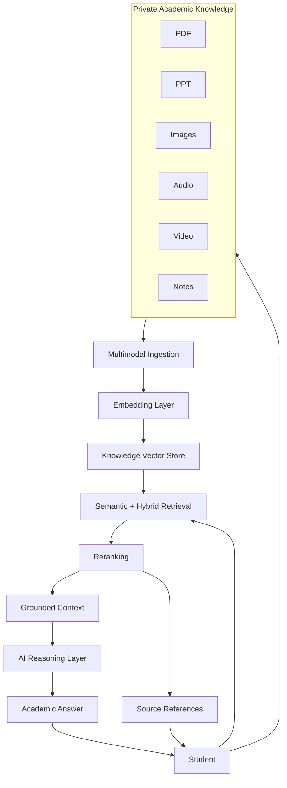

> **Important:** The above represents the long-term vision. The current implementation is primarily PDF text ingestion + semantic retrieval + RAG + local Llama 3.2 inference.

---

# Conclusion

ProfessorMind AI demonstrates how modern AI techniques can be combined with full-stack software engineering to create a private academic knowledge assistant.

The current system combines:

```text
React
   +
TypeScript
   +
Vite
   +
FastAPI
   +
Python
   +
PyMuPDF
   +
Sentence Transformers
   +
FAISS
   +
Ollama
   +
Llama 3.2
   +
Database
   +
RAG
```

The core architecture is intentionally modular.

The current implementation focuses on reliable PDF-based knowledge retrieval and grounded question answering.

The architecture also provides a foundation for future improvements such as:

* OCR
* Multimodal document understanding
* PowerPoint processing
* Image understanding
* Audio/video processing
* Hybrid retrieval
* Reranking
* Better source citation
* Authentication
* Authorization
* Cloud deployment
* Background processing
* Production-scale AI infrastructure

The central idea remains simple:

> **Upload your academic knowledge. Retrieve the right information. Generate grounded answers. Keep the knowledge private.**

---

# ProfessorMind AI

## Private Academic Knowledge. Intelligent Retrieval. Grounded Answers.

```text
PDF
 |
 v
Extract
 |
 v
Chunk
 |
 v
Embed
 |
 v
FAISS
 |
 v
Retrieve
 |
 v
Context
 |
 v
Llama 3.2
 |
 v
Answer
 |
 v
Sources
```

---

## Project Summary

```text
Project Name
ProfessorMind AI

Project Type
Professor-Centric AI Learning Assistant

Primary Architecture
Retrieval-Augmented Generation (RAG)

Current Knowledge Source
Uploaded Academic PDFs

Document Processing
PyMuPDF

Embedding Layer
Sentence Transformers

Vector Search
FAISS

Backend
Python + FastAPI

Frontend
React + TypeScript + Vite

Local LLM Runtime
Ollama

Language Model
Llama 3.2

Application Database
Configured Database / SQLAlchemy

Primary Retrieval Scope
Notebook-specific academic knowledge

Current Focus
PDF-based private lecture knowledge retrieval

Future Direction
Multimodal academic learning assistant
```

---

## Final Architecture Summary

```text
                    ┌───────────────────────┐
                    │       Student         │
                    └───────────┬───────────┘
                                │
                                v
                    ┌───────────────────────┐
                    │ React + TypeScript    │
                    │       Frontend        │
                    └───────────┬───────────┘
                                │
                                v
                    ┌───────────────────────┐
                    │ FastAPI Backend       │
                    │       :8001           │
                    └───────────┬───────────┘
                                │
              ┌─────────────────┴─────────────────┐
              │                                   │
              v                                   v
    ┌───────────────────┐              ┌───────────────────┐
    │ Document Pipeline  │              │   Question/RAG    │
    └─────────┬─────────┘              └─────────┬─────────┘
              │                                  │
              v                                  v
        ┌───────────┐                    ┌──────────────┐
        │ PyMuPDF   │                    │   Retrieval  │
        └─────┬─────┘                    └──────┬───────┘
              │                                  │
              v                                  v
        ┌───────────┐                    ┌──────────────┐
        │ Chunking  │                    │    FAISS     │
        └─────┬─────┘                    └──────┬───────┘
              │                                  │
              v                                  v
        ┌───────────────┐               ┌──────────────┐
        │  Embeddings   │               │   Relevant   │
        │  Sentence     │               │    Chunks    │
        │  Transformers │               └──────┬───────┘
        └───────┬───────┘                      │
                │                              v
                v                       ┌──────────────┐
          ┌───────────┐                  │Context Build │
          │   FAISS   │                  └──────┬───────┘
          └───────────┘                         │
                                                v
                                         ┌──────────────┐
                                         │    Ollama    │
                                         └──────┬───────┘
                                                │
                                                v
                                         ┌──────────────┐
                                         │  Llama 3.2   │
                                         └──────┬───────┘
                                                │
                                                v
                                         ┌──────────────┐
                                         │    Grounded  │
                                         │    Answer    │
                                         └──────┬───────┘
                                                │
                                                v
                                         ┌──────────────┐
                                         │    Sources   │
                                         │ Page + File  │
                                         └──────────────┘
```

---

> **ProfessorMind AI — From Private Lecture Material to Grounded Academic Answers.**
