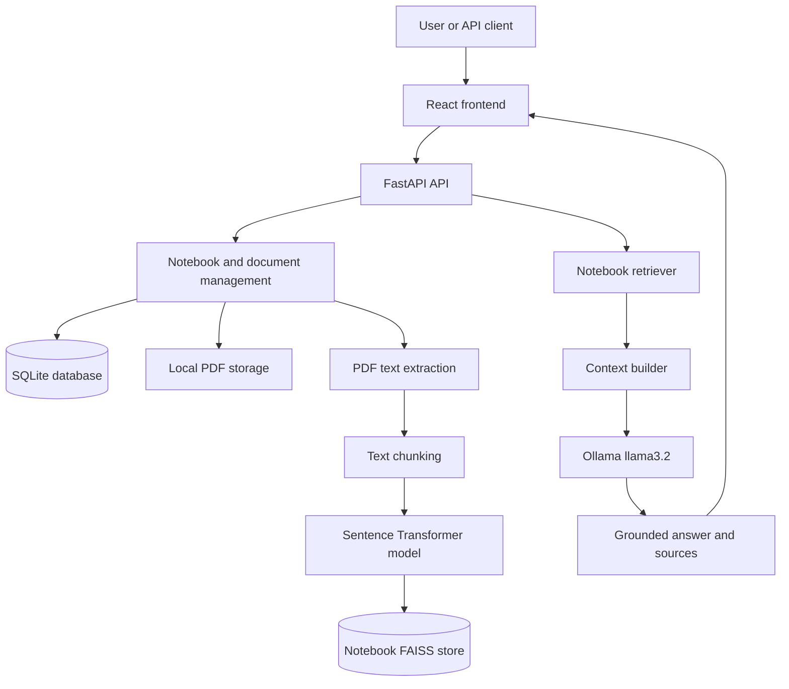
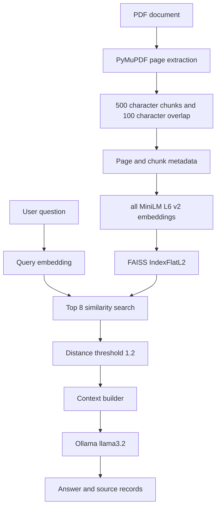
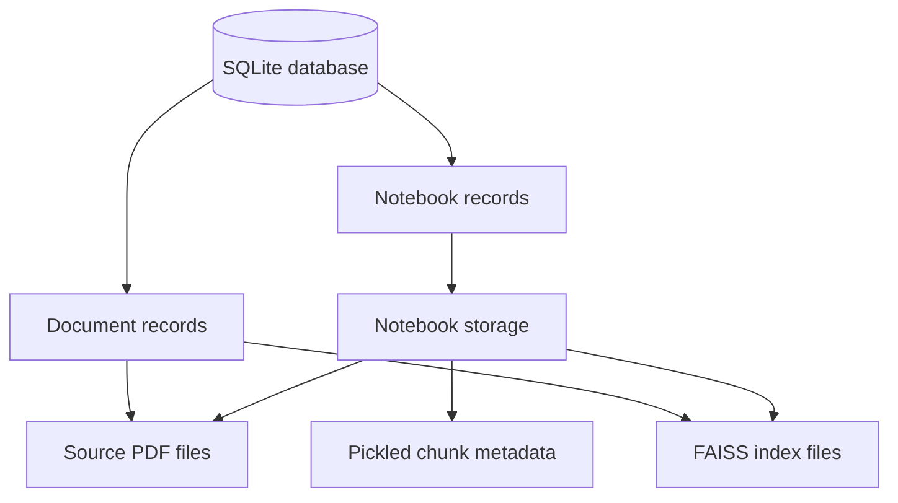

# ProfessorMind AI

> Professor-centric AI learning assistant for private lecture knowledge retrieval using Retrieval-Augmented Generation.

[](https://www.python.org/)
[](https://fastapi.tiangolo.com/)
[](https://react.dev/)
[](https://www.typescriptlang.org/)
[](https://www.sqlite.org/)
[](https://github.com/facebookresearch/faiss)
[](https://ollama.com/)

## Overview

ProfessorMind AI is a collaborative final-year major project for asking questions about private lecture material. Its implemented backend organizes uploaded PDF files into notebooks, extracts page text, creates searchable embeddings, and uses retrieved lecture context to generate grounded answers with a locally hosted Ollama model.

The current repository contains a working FastAPI backend and a React/Vite frontend foundation. The backend implements the document-ingestion and notebook-scoped RAG workflow. The frontend source tree contains the intended UI structure, but the active application entry point is still the Vite starter screen and is not yet connected to the backend.

## Problem Statement

Students often need to search across course notes and ask questions about a specific set of lecture documents. A general-purpose language model may introduce information that is not present in those notes. ProfessorMind AI addresses this by retrieving relevant content from a selected notebook before generating an answer.

## Solution

1. A user creates a notebook.
2. The user uploads a PDF into that notebook.
3. The backend extracts text page by page, splits it into overlapping chunks, embeds the chunks, and stores them in a notebook-specific FAISS index.
4. A question is embedded and searched against that notebook.
5. The retrieved context is sent to Ollama with instructions to answer only from the uploaded lecture material.
6. The API returns the answer and source metadata such as page number, chunk index, and distance.

The current ingestion path is text-based PDF processing. OCR, image understanding, and other multimodal processing are future scope rather than implemented features.

## Key Features

### Knowledge Management

- Create, list, inspect, and delete notebooks.
- Upload PDF files into a selected notebook.
- Store source PDFs in notebook-specific directories.
- List documents globally or within a notebook.
- Delete a document and rebuild the notebook FAISS index from remaining chunks.
- Track document status, page count, chunk count, and embedding dimension.

### RAG Pipeline

- Extract page text with PyMuPDF.
- Preserve page and chunk metadata.
- Split pages with a 500-character chunk size and 100-character overlap.
- Generate embeddings with `all-MiniLM-L6-v2`.
- Store vectors in FAISS `IndexFlatL2` indexes.
- Retrieve up to 8 chunks by default and filter distances above `1.2`.
- Build context from retrieved chunks.

### AI Assistant

- Answer questions within the selected notebook.
- Use local Ollama inference with the configured `llama3.2` model.
- Return source records with file ID, page number, chunk index, text, and distance.
- Return an out-of-scope response when no relevant chunks pass the distance filter.

### Frontend Foundation

- React, TypeScript, and Vite project configuration.
- An active Vite starter screen with a counter and framework links.
- Planned UI directories for dashboard, notebooks, documents, upload, chat, layout, hooks, services, and shared types.

The planned frontend modules are not presented as completed product features because their files are currently empty or are not mounted by `App.tsx`.

## System Architecture



The backend registers its routers under `/api`. SQLite stores notebook and document metadata. Original PDFs and generated FAISS files are stored locally under `storage/notebooks`.

## End-to-End Workflow


## RAG Pipeline



### Ingestion

`POST /api/notebooks/{notebook_id}/upload-pdf` accepts a multipart field named `file`. The route checks for `application/pdf`, saves the file with a generated UUID-based filename, extracts text from each page, and creates chunks page by page.

### Chunking

`RecursiveCharacterTextSplitter` uses `chunk_size=500`, `chunk_overlap=100`, and the separators `"\\n\\n"`, `"\\n"`, `". "`, `" "`, and `""`. Each chunk stores a global chunk index, page number, page-local chunk index, text, and file ID.

### Embeddings and vector search

`SentenceTransformer("all-MiniLM-L6-v2")` generates NumPy embeddings. FAISS uses `IndexFlatL2`, stores the index as `index.faiss`, and stores chunk metadata as `metadata.pkl`. Search defaults to `top_k=8` and excludes results with distance greater than `1.2`.

### Answer generation

The RAG service retrieves chunks, builds context, calls Ollama with model `llama3.2` at temperature `0`, and returns the generated answer with source metadata. The prompt instructs the model to use only the supplied lecture material and not to add unsupported facts.

## AI Question Answering

The question request accepts a notebook ID, question, and optional `top_k`. Retrieval is notebook-scoped. When no relevant chunks are found, the backend returns:

```text
This question is outside the scope of the uploaded notes.
```

Successful responses have the following top-level shape:

```json
{
  "question": "...",
  "answer": "...",
  "sources": [
    {
      "file_id": "...",
      "page_number": 1,
      "chunk_index": 0,
      "text": "...",
      "distance": 0.42
    }
  ]
}
```

## Backend Architecture

| Component | Responsibility |
|---|---|
| `backend/main.py` | Creates database tables, configures FastAPI, registers routers, and exposes the root endpoint. |
| `backend/api/notebooks.py` | Creates, lists, retrieves, and deletes notebooks. |
| `backend/api/upload.py` | Validates PDF uploads and runs ingestion, embedding, indexing, and document status updates. |
| `backend/api/documents.py` | Lists documents and deletes documents while rebuilding FAISS data. |
| `backend/api/question.py` | Validates question requests and invokes the RAG service. |
| `backend/services/pdf_extractor.py` | Extracts page text with PyMuPDF. |
| `backend/services/text_chunker.py` | Splits page text into overlapping chunks. |
| `backend/services/embedding_service.py` | Loads and calls the sentence-transformer model. |
| `backend/services/vector_store.py` | Creates, saves, loads, updates, and searches FAISS indexes. |
| `backend/services/retrieval_service.py` | Embeds questions and retrieves notebook chunks. |
| `backend/services/context_builder.py` | Formats retrieved chunks as model context. |
| `backend/services/llm_service.py` | Calls the local Ollama model. |
| `backend/services/rag_service.py` | Orchestrates retrieval, context construction, generation, and sources. |
| `backend/models/document.py` | Defines the SQLAlchemy document entity. |
| `backend/models/notebook.py` | Defines the SQLAlchemy notebook entity. |
| `backend/database.py` | Configures the SQLite SQLAlchemy engine and sessions. |

## Frontend Architecture

The frontend is configured as a React 19, TypeScript, and Vite application. The active runtime path is:

`frontend/src/main.tsx` -> `frontend/src/App.tsx` -> Vite starter UI

The repository also contains planned frontend structure for:

| Area | Present source structure | Current state |
|---|---|---|
| Pages | `src/pages` | Files exist but are empty. |
| Components | `src/components` | Files exist but are empty. |
| Routes | `src/routes/AppRoutes.tsx` | Empty and not mounted. |
| Services | `src/services` | Files exist but are empty; no API client is active. |
| Hooks | `src/hooks` | Files exist but are empty. |
| Context | `src/context/AppContext.tsx` | Empty and not mounted. |
| Types and utilities | `src/types`, `src/utils` | Files exist but are empty. |
| Active screen | `src/App.tsx` | Vite starter screen with a counter and external framework links. |

`axios`, `react-router-dom`, and `lucide-react` are declared dependencies, but the current active application does not use them. A local `frontend/.env` file contains `VITE_API_URL`, while the current source does not read it because the API service layer is empty.

## Project Structure

```text
ProfessorMindAI/
├── backend/
│   ├── api/
│   │   ├── documents.py
│   │   ├── notebooks.py
│   │   ├── question.py
│   │   └── upload.py
│   ├── models/
│   │   ├── document.py
│   │   └── notebook.py
│   ├── services/
│   │   ├── context_builder.py
│   │   ├── embedding_service.py
│   │   ├── llm_service.py
│   │   ├── pdf_extractor.py
│   │   ├── rag_service.py
│   │   ├── retrieval_service.py
│   │   ├── text_chunker.py
│   │   └── vector_store.py
│   ├── database.py
│   ├── main.py
│   └── test_*.py
├── frontend/
│   ├── src/
│   │   ├── components/
│   │   ├── context/
│   │   ├── hooks/
│   │   ├── pages/
│   │   ├── routes/
│   │   ├── services/
│   │   ├── types/
│   │   ├── utils/
│   │   ├── App.tsx
│   │   └── main.tsx
│   ├── package.json
│   ├── tsconfig*.json
│   └── vite.config.ts
├── requirements.txt
├── .gitignore
└── README.md
```

## Technology Stack

| Layer | Technology | Purpose |
|---|---|---|
| Backend | Python, FastAPI `0.115.6`, Uvicorn `0.34.0` | REST API and local development server. |
| Frontend | React `19.2.8`, TypeScript `6.0.2`, Vite `8.3.0` | Frontend foundation and active starter UI. |
| Database | SQLite and SQLAlchemy `2.0.41` | Notebook and document metadata. |
| PDF processing | PyMuPDF `1.28.2` | Page-level text extraction. |
| Chunking | LangChain text splitter | Recursive character chunking. |
| Embeddings | Sentence Transformers `5.7.0` | Semantic text embeddings. |
| Vector store | FAISS CPU `1.15.0` | Exact L2 similarity search. |
| LLM runtime | Ollama with `llama3.2` | Local answer generation. |
| Frontend libraries | Axios, React Router, Lucide React | Declared dependencies for planned UI layers. |

`ollama` is imported by the backend but is not pinned in `requirements.txt`; install the Ollama Python client separately unless it is already available in the environment. The chunker imports `langchain_text_splitters`, so verify that the installed LangChain packages provide that module.

## Installation

### Prerequisites

- Python and PowerShell on Windows.
- Node.js and npm for the frontend.
- Ollama installed and running locally.
- The Ollama model `llama3.2` available locally for question answering.

### Backend

Run from the repository root:

```powershell
python -m venv venv
.\venv\Scripts\Activate.ps1
python -m pip install --upgrade pip
pip install -r requirements.txt
pip install ollama
```

### Frontend

```powershell
cd frontend
npm install
```

## Configuration

The backend currently uses fixed local configuration:

| Setting | Current value | Source |
|---|---|---|
| Database | `sqlite:///./professormind.db` | `backend/database.py` |
| Vector storage | `storage/notebooks` | `backend/services/vector_store.py` |
| Embedding model | `all-MiniLM-L6-v2` | `backend/services/embedding_service.py` |
| LLM model | `llama3.2` | `backend/services/llm_service.py` |
| Retrieval defaults | `top_k=8`, distance threshold `1.2` | `backend/services/retrieval_service.py` and `rag_service.py` |

No backend environment variables are read. `frontend/.env.example` is empty. A local frontend `.env` may define `VITE_API_URL`, but the current frontend source does not consume it because the API service layer is empty. Do not commit local secrets or environment files.

## Running the Project

## Backend

From the repository root, activate the virtual environment:

```powershell
.\.venv-clean\Scripts\Activate.ps1
```

Then start the FastAPI backend using Uvicorn:

```powershell
python -m uvicorn backend.main:app --host 127.0.0.1 --port 8001
```

### Backend Server Details

| Detail      | Value                                                             |
| ----------- | ----------------------------------------------------------------- |
| **PID**     | 11168                                                             |
| **Process** | `python.exe`                                                      |
| **Python**  | `C:\Python312\python.exe`                                         |
| **Command** | `python -m uvicorn backend.main:app --host 127.0.0.1 --port 8001` |
| **Host**    | `127.0.0.1`                                                       |
| **Port**    | `8001`                                                            |
| **Started** | 10:45:24 PM                                                       |

### Local Backend URLs

**Backend API:**

```text
http://127.0.0.1:8001
```

**FastAPI Swagger Documentation:**

```text
http://127.0.0.1:8001/docs
```

**Alternative ReDoc Documentation:**

```text
http://127.0.0.1:8001/redoc
```

> **Note:** Since the backend is running on port **8001**, all API requests and FastAPI documentation URLs should use `8001`, not `8000`.

### Frontend

In a second terminal:

```powershell
cd frontend
npm run dev
```

Vite reports the local development URL when it starts, normally `http://localhost:5173`. The current screen is not connected to the backend API.

## API Reference

The routers in `backend/main.py` are mounted with the `/api` prefix.

| Method | Endpoint | Request | Purpose and important response fields |
|---|---|---|---|
| `GET` | `/` | None | Backend status message. |
| `POST` | `/api/notebooks` | JSON: `name`, optional `description` | Creates a notebook and storage directories; returns notebook ID, name, description, and creation time. |
| `GET` | `/api/notebooks` | None | Returns all notebooks with document summaries. |
| `GET` | `/api/notebooks/{notebook_id}` | Path parameter `notebook_id` | Returns one notebook and its documents. |
| `DELETE` | `/api/notebooks/{notebook_id}` | Path parameter `notebook_id` | Deletes a notebook and its associated records/storage. |
| `POST` | `/api/notebooks/{notebook_id}/upload-pdf` | Multipart file field `file` | Processes a PDF and returns file ID, page count, chunk count, embedding dimension, FAISS vector count, and status. |
| `GET` | `/api/documents` | None | Returns all notebooks with their document records. |
| `GET` | `/api/notebooks/{notebook_id}/documents` | Path parameter `notebook_id` | Returns documents belonging to one notebook. |
| `DELETE` | `/api/notebooks/{notebook_id}/documents/{file_id}` | Path parameters `notebook_id`, `file_id` | Deletes a document and rebuilds or removes the notebook FAISS data. |
| `POST` | `/api/ask` | JSON: `notebook_id`, `question`, optional `top_k` | Retrieves context and returns `question`, `answer`, and `sources`; `top_k` defaults to `8`. |

### Example question request

```powershell
curl.exe -X POST http://127.0.0.1:8000/api/ask `
  -H "Content-Type: application/json" `
  -d '{"notebook_id":"<notebook-id>","question":"What is described in the notes?","top_k":8}'
```

The upload route returns HTTP 400 for non-PDF content types, HTTP 404 for a missing notebook, and HTTP 500 when processing fails. The question route returns HTTP 404 when the notebook FAISS index is unavailable and HTTP 500 for unexpected errors.

> **Implementation note:** `backend/api/documents.py` and `backend/api/notebooks.py` both declare `DELETE /notebooks/{notebook_id}`. Because both routers are mounted under `/api`, this duplicate route should be consolidated to avoid ambiguous behavior.

## Database and Storage Architecture

SQLite is configured as `professormind.db`. SQLAlchemy models define:

- `Notebook`: notebook ID, name, description, and creation time.
- `Document`: file ID, notebook ID, filename, stored filename, page count, chunk count, embedding dimension, status, error message, and upload time.

Notebook files are stored locally as follows:

```text
storage/
└── notebooks/
    └── notebook-id/
        ├── sources/
        │   └── generated-file-id.pdf
        └── faiss/
            ├── index.faiss
            └── metadata.pkl
```



The root `.gitignore` excludes virtual environments, database files, uploaded PDFs, notebook storage, and generated vector-store directories.

## Testing

The repository contains six executable Python scripts rather than a configured `pytest` suite:

| Script | Intended coverage |
|---|---|
| `backend/test_extractor.py` | PDF page text extraction. |
| `backend/test_chunker.py` | Extraction followed by text chunking. |
| `backend/test_embeddings.py` | Extraction, chunking, and embedding generation. |
| `backend/test_vector_store.py` | FAISS index creation and persistence. |
| `backend/test_retrieval.py` | Retrieval from stored vector data. |
| `backend/test_rag.py` | Answer generation and source output. |

The scripts currently depend on sample files under `storage/pdfs`, use older file-based assumptions in places, and include references to helper signatures that no longer match the notebook-based implementation. They are useful development experiments but should be updated with fixtures and assertions before being treated as regression tests.

## Security and Privacy

The current design keeps PDF files, metadata, vector indexes, and LLM inference local to the development environment. The repository ignores local database, storage, and environment files.

Authentication, authorization, user isolation, rate limiting, request-size controls, malware scanning, HTTPS, and production secret management are not implemented. The current version is designed primarily for local development and academic demonstration. Production deployment would require these controls and additional input validation.

## Current Status

### Implemented

- FastAPI backend with notebook, document, upload, and question routes.
- SQLite metadata models for notebooks and documents.
- Text-based PDF extraction with page metadata.
- Chunking, embeddings, FAISS persistence, filtered retrieval, and local Ollama generation.
- Source metadata in question responses.
- React/Vite project configuration and active starter screen.

### In Progress

- Frontend product integration. The repository has planned page, component, hook, service, context, route, type, and utility files, but they are not yet connected to the active `App.tsx` entry point.

### Planned

- OCR and image/table understanding for scanned or visual lecture content.
- Authentication and multi-user notebook isolation.
- Maintained automated tests and evaluation datasets.
- Production-oriented storage, configuration, and deployment controls.

## Future Enhancements

- Connect the React pages and components to the FastAPI endpoints.
- Add OCR for scanned PDFs and support for visual document content.
- Add conversation history and streamed answers.
- Improve citation presentation in the user interface.
- Add retrieval and answer-quality evaluation.
- Make model, database, and storage settings configurable.
- Replace local-only storage with scalable infrastructure when required.

## Screenshots and Demo

The repository contains frontend assets, including `frontend/src/assets/hero.png`, but no completed product screenshots, hosted demo, video, or deployment URL. Demonstration media can be added as the application UI is finalized.


## AI Development Tools

AI-assisted development tools may have been used during development for code assistance, debugging, documentation, and development workflow support. Specific tools and contributors to individual changes are not documented in the repository.

## License

No `LICENSE` file or license declaration is currently present. No license has been specified for this repository yet.

## Conclusion

ProfessorMind AI currently provides a local, notebook-scoped RAG backend for retrieving and answering questions from extractable text in private lecture PDFs. The core ingestion, embedding, FAISS retrieval, and Ollama generation workflow is implemented, while frontend integration, broader multimodal processing, production security, and maintained automated testing remain active project scope.
