````markdown
# ProfessorMind AI

### Professor-Centric AI Learning Assistant Using Retrieval-Augmented Generation for Private Lecture Knowledge Retrieval

ProfessorMind AI is a private academic knowledge assistant designed to help students interact with their lecture materials using Artificial Intelligence.

The system allows students to upload lecture PDFs, process their contents, create semantic vector representations, store them in FAISS, retrieve the most relevant sections for a question, and generate grounded answers using a locally running Llama 3.2 model through Ollama.

The primary objective is to provide answers based on the student's own academic material instead of relying on general-purpose model knowledge.

---

## Table of Contents

- [Project Overview](#project-overview)
- [Problem Statement](#problem-statement)
- [Project Objectives](#project-objectives)
- [Core Idea](#core-idea)
- [Key Features](#key-features)
- [System Architecture](#system-architecture)
- [End-to-End Workflow](#end-to-end-workflow)
- [Current RAG Pipeline](#current-rag-pipeline)
- [Retrieval-Augmented Generation](#retrieval-augmented-generation)
- [PDF Ingestion Pipeline](#pdf-ingestion-pipeline)
- [Text Extraction](#text-extraction)
- [Document Chunking](#document-chunking)
- [Embeddings](#embeddings)
- [FAISS Vector Store](#faiss-vector-store)
- [Question Answering Pipeline](#question-answering-pipeline)
- [Context Construction](#context-construction)
- [LLM Generation](#llm-generation)
- [Grounded Answering](#grounded-answering)
- [Source References](#source-references)
- [Notebook Isolation](#notebook-isolation)
- [Technology Stack](#technology-stack)
- [Project Architecture](#project-architecture)
- [Backend Architecture](#backend-architecture)
- [Frontend Architecture](#frontend-architecture)
- [Database Architecture](#database-architecture)
- [Storage Architecture](#storage-architecture)
- [API Reference](#api-reference)
- [API Request Example](#api-request-example)
- [API Response Structure](#api-response-structure)
- [Environment Setup](#environment-setup)
- [Prerequisites](#prerequisites)
- [Backend Setup](#backend-setup)
- [Frontend Setup](#frontend-setup)
- [Ollama Setup](#ollama-setup)
- [Running the Application](#running-the-application)
- [Project Directory Structure](#project-directory-structure)
- [Data Flow](#data-flow)
- [Retrieval Strategy](#retrieval-strategy)
- [Retrieval Parameters](#retrieval-parameters)
- [Retrieval Evaluation](#retrieval-evaluation)
- [Testing](#testing)
- [Failure Handling](#failure-handling)
- [Security Considerations](#security-considerations)
- [Privacy](#privacy)
- [Current Implementation Status](#current-implementation-status)
- [Known Limitations](#known-limitations)
- [Future Scope](#future-scope)
- [Multimodal Expansion](#multimodal-expansion)
- [Performance Considerations](#performance-considerations)
- [Design Principles](#design-principles)
- [Why RAG](#why-rag)
- [Why FAISS](#why-faiss)
- [Why Local LLM](#why-local-llm)
- [Why Ollama](#why-ollama)
- [Why Sentence Transformers](#why-sentence-transformers)
- [Advantages](#advantages)
- [Challenges](#challenges)
- [Use Cases](#use-cases)
- [Academic Value](#academic-value)
- [Engineering Value](#engineering-value)
- [Viva Explanation](#viva-explanation)
- [Common Viva Questions](#common-viva-questions)
- [Useful Commands](#useful-commands)
- [Development Workflow](#development-workflow)
- [Troubleshooting](#troubleshooting)
- [Responsible AI Considerations](#responsible-ai-considerations)
- [Future Production Architecture](#future-production-architecture)
- [Project Status](#project-status)
- [Conclusion](#conclusion)

---

# Project Overview

ProfessorMind AI is a professor-centric academic learning assistant that combines:

- Document processing
- Semantic embeddings
- Vector search
- Retrieval-Augmented Generation
- Local Large Language Models
- Source-aware answering
- Notebook-based knowledge isolation
- React-based user interface
- FastAPI backend
- PostgreSQL/SQLAlchemy-based application data management
- FAISS-based vector retrieval

The system is designed around one fundamental principle:

> **The AI should answer from the student's uploaded academic knowledge whenever possible.**

Instead of directly asking an LLM to answer a question from its pretrained knowledge, ProfessorMind AI first searches the student's uploaded lecture material.

The retrieved content is then provided to the LLM as context.

The LLM generates an answer based on that context.

---

# Problem Statement

Students commonly maintain lecture notes, PDFs, presentations, assignments, and other academic documents across different locations.

Finding a specific concept inside large lecture documents can be difficult and time-consuming.

Traditional keyword search also has limitations.

For example, a student may ask:

> "Explain the difference between batch and stochastic gradient descent."

The exact words used in the question may not appear together in the document.

A semantic retrieval system can identify conceptually related content even when the wording is different.

ProfessorMind AI addresses this problem by creating a searchable semantic representation of academic documents.

---

# Project Objectives

The major objectives of ProfessorMind AI are:

1. Allow students to upload academic lecture PDFs.
2. Extract text from uploaded documents.
3. Preserve page-level document information.
4. Divide documents into manageable chunks.
5. Generate semantic embeddings for each chunk.
6. Store embeddings in a FAISS vector index.
7. Retrieve relevant chunks for student questions.
8. Build a structured context from retrieved chunks.
9. Send the context to a local Llama 3.2 model.
10. Generate answers grounded in uploaded lecture material.
11. Provide source document and page references.
12. Keep knowledge separated between notebooks.
13. Reduce dependence on external cloud LLM APIs.
14. Provide a clean academic-focused user interface.
15. Create a foundation for future multimodal learning capabilities.

---

# Core Idea

The system follows this simplified process:

```text
Student Question
       |
       v
Convert Question to Embedding
       |
       v
Search FAISS Vector Index
       |
       v
Retrieve Relevant Lecture Chunks
       |
       v
Build Context
       |
       v
Local Llama 3.2
       |
       v
Grounded Answer
       |
       v
Source / Page References
````

The LLM is not treated as the primary knowledge source.

The uploaded lecture material is treated as the primary knowledge source.

---

# Key Features

## Academic Knowledge Workspace

Students can organize their academic material into notebooks.

Each notebook represents an isolated knowledge space.

---

## PDF Upload

The current implementation supports PDF document ingestion.

The system:

1. Receives the PDF.
2. Validates the file.
3. Stores the source document.
4. Extracts page-level text.
5. Creates chunks.
6. Generates embeddings.
7. Stores the vectors in FAISS.
8. Stores document metadata.

---

## Semantic Search

The system does not depend only on exact keyword matching.

Questions are converted into embeddings and compared against document embeddings.

This allows conceptually related chunks to be retrieved.

---

## Retrieval-Augmented Generation

ProfessorMind AI uses a RAG architecture.

The system retrieves relevant academic information before asking the LLM to generate the answer.

---

## Local LLM

The current implementation uses:

```text
Llama 3.2
      |
    Ollama
      |
    Local Machine
```

This provides a local inference workflow without requiring the academic document content to be sent to a third-party hosted LLM API.

---

## Source References

Retrieved document information is returned with metadata such as:

* File ID
* Filename
* Page number
* Chunk index
* Retrieved text

This allows the interface to display where the answer context came from.

---

## Notebook Isolation

Each notebook has its own retrieval space.

Conceptually:

```text
Notebook A
   |
   +-- Documents
   +-- Chunks
   +-- FAISS Index

Notebook B
   |
   +-- Documents
   +-- Chunks
   +-- FAISS Index
```

A question associated with one notebook should retrieve information from that notebook's knowledge base.

---

# System Architecture

The high-level system architecture is:

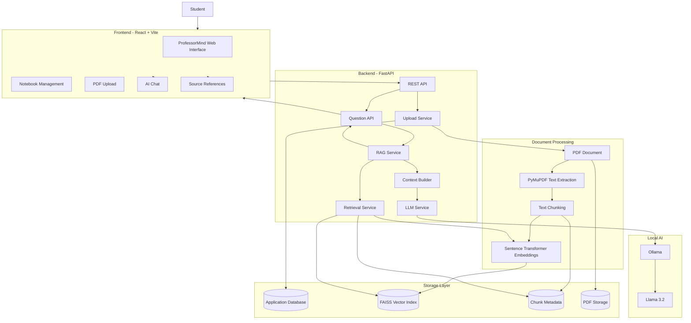

---

# End-to-End Workflow

The complete system workflow is:

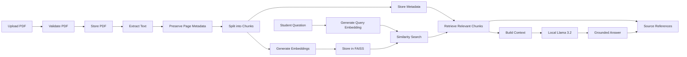

---

# Current RAG Pipeline

The currently implemented RAG pipeline is:

```text
PDF
 |
 v
PyMuPDF
 |
 v
Page-Level Text
 |
 v
Chunking
 |
 v
Sentence Transformer
 |
 v
Embeddings
 |
 v
FAISS
 |
 v
Question Embedding
 |
 v
Similarity Search
 |
 v
Relevant Chunks
 |
 v
Context Builder
 |
 v
Llama 3.2 via Ollama
 |
 v
Grounded Answer
 |
 v
Source References
```

---

# Retrieval-Augmented Generation

## What is RAG?

Retrieval-Augmented Generation combines two major operations:

```text
Retrieval
+
Generation
```

### Retrieval

The system searches an external knowledge source for relevant information.

### Generation

The retrieved information is passed to a language model, which generates a natural-language answer.

ProfessorMind AI uses the student's uploaded lecture material as the retrieval knowledge source.

---

# RAG Architecture

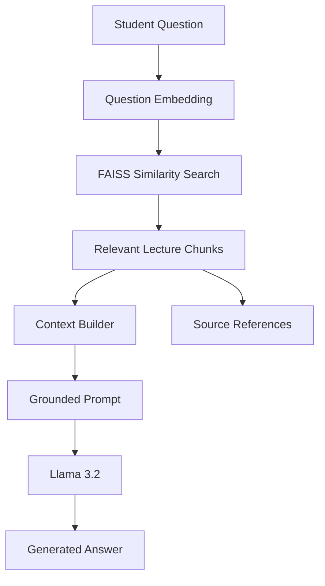

---

# PDF Ingestion Pipeline

The current implementation begins with PDF ingestion.

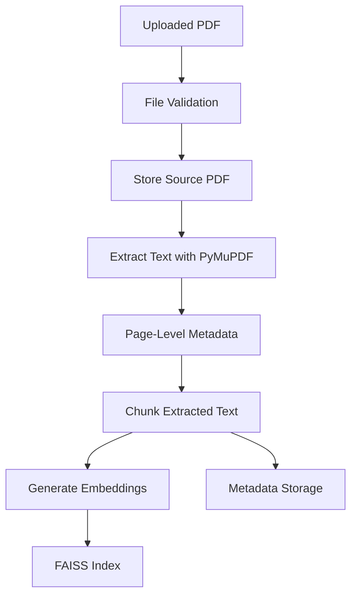

---

# Text Extraction

The current PDF processing implementation uses PyMuPDF.

The extraction process preserves page information.

Conceptually:

```text
PDF
 |
 +-- Page 1
 |     |
 |     +-- Extracted Text
 |
 +-- Page 2
 |     |
 |     +-- Extracted Text
 |
 +-- Page 3
       |
       +-- Extracted Text
```

Page information is important because the final system needs to identify the source location of retrieved information.

---

# Document Chunking

Large documents are not sent directly to the embedding model or LLM as one large block.

The extracted text is divided into smaller chunks.

Example:

```text
Document
   |
   +-- Chunk 1
   +-- Chunk 2
   +-- Chunk 3
   +-- Chunk 4
   +-- ...
```

Each chunk can contain metadata such as:

```text
file_id
filename
page_number
chunk_index
text
```

Chunking improves retrieval because the system can retrieve specific portions of a document rather than an entire document.

---

# Embeddings

An embedding converts text into a numerical vector representation.

Conceptually:

```text
"Gradient Descent"

        |
        v

[0.12, -0.45, 0.71, ...]
```

Semantically similar text tends to have similar vector representations.

ProfessorMind AI uses Sentence Transformers to generate embeddings.

The same embedding process is used for:

* Document chunks
* Student questions

This allows the system to compare questions with stored document content.

---

# FAISS Vector Store

FAISS is used as the vector similarity search engine.

FAISS stands for:

> Facebook AI Similarity Search

The system stores document embeddings in a FAISS index.

Conceptually:

```text
Document Chunk
      |
      v
Embedding Vector
      |
      v
FAISS Index
```

When the student asks a question:

```text
Question
   |
   v
Question Embedding
   |
   v
FAISS Similarity Search
   |
   v
Top Relevant Chunks
```

---

# FAISS Search Process

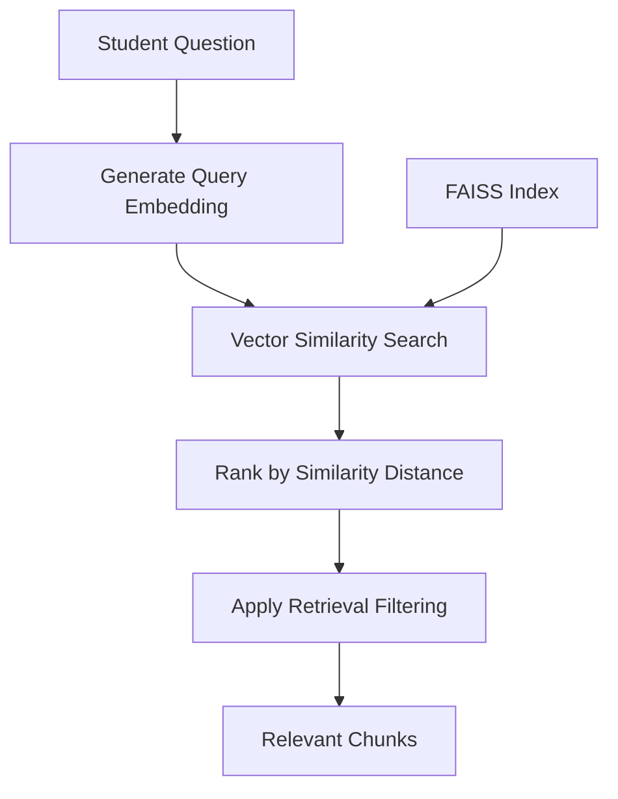

---

# Question Answering Pipeline

The question-answering process is:

```text
Student Question
       |
       v
Question API
       |
       v
Notebook Validation
       |
       v
RAG Service
       |
       v
Retrieval Service
       |
       v
Query Embedding
       |
       v
FAISS Search
       |
       v
Relevant Chunks
       |
       v
Context Builder
       |
       v
LLM Service
       |
       v
Ollama
       |
       v
Llama 3.2
       |
       v
Grounded Answer
       |
       v
Source References
```

---

# Context Construction

Retrieved chunks are not blindly concatenated.

The context builder prepares retrieved information into a structured format.

A simplified representation is:

```text
--- Page 38 ---

Relevant lecture content...

--- Page 39 ---

Relevant lecture content...

--- Page 40 ---

Relevant lecture content...
```

The context builder is responsible for:

* Normalizing retrieved chunks
* Removing duplicates
* Organizing chunks
* Preserving page information
* Preserving document metadata
* Creating a structured context for the LLM

---

# LLM Generation

The current LLM layer uses:

```text
Ollama
   |
   v
Llama 3.2
```

The LLM receives:

```text
Student Question
+
Retrieved Lecture Context
```

The goal is to generate an answer based on the retrieved material.

---

# Grounded Answering

ProfessorMind AI follows a grounding principle:

> If the uploaded notes do not provide enough information to answer the question, the system should not invent an answer from general model knowledge.

For unsupported questions, the system can return a response such as:

```text
This question is outside the scope of the uploaded notes.
```

This behavior is important for academic reliability.

---

# Source References

Source information is generated from retrieval metadata rather than asking the LLM to invent page numbers.

Example conceptual output:

```text
Sources

DEEP LEARNING .pdf
Page 38
Page 39
Page 81
```

The backend source structure can contain:

```json
{
  "file_id": "document-id",
  "filename": "lecture.pdf",
  "page_number": 38,
  "chunk_index": 157,
  "text": "Retrieved lecture content..."
}
```

The exact source list depends on the retrieved chunks.

---

# Why Source References Matter

Source references improve:

* Transparency
* Academic traceability
* Debugging
* User confidence
* Retrieval evaluation

They also allow developers to inspect whether the retrieved context actually corresponds to the generated answer.

---

# Notebook Isolation

Each notebook represents a separate academic knowledge space.

For example:

```text
Notebook: Deep Learning
 |
 +-- Deep Learning.pdf
 +-- CNN Notes.pdf
 +-- RNN Notes.pdf
 +-- FAISS Index
```

Another notebook may contain:

```text
Notebook: Machine Learning
 |
 +-- ML Notes.pdf
 +-- Regression.pdf
 +-- Classification.pdf
 +-- FAISS Index
```

The retrieval process is scoped to the requested notebook.

This prevents unrelated notebook documents from becoming retrieval context.

---

# Technology Stack

## Frontend

| Technology         | Purpose                        |
| ------------------ | ------------------------------ |
| React              | User interface                 |
| TypeScript         | Type-safe frontend development |
| Vite               | Frontend build tool            |
| React Router       | Client-side routing            |
| Tailwind CSS / CSS | UI styling                     |
| Lucide React       | Interface icons                |

---

## Backend

| Technology | Purpose                   |
| ---------- | ------------------------- |
| Python     | Backend and AI processing |
| FastAPI    | REST API                  |
| Uvicorn    | ASGI server               |
| Pydantic   | Request validation        |
| SQLAlchemy | Database ORM              |

---

## AI / RAG

| Technology            | Purpose                  |
| --------------------- | ------------------------ |
| PyMuPDF               | PDF text extraction      |
| Sentence Transformers | Text embeddings          |
| FAISS                 | Vector similarity search |
| Ollama                | Local LLM runtime        |
| Llama 3.2             | Local language model     |

---

## Database / Storage

| Technology                       | Purpose               |
| -------------------------------- | --------------------- |
| SQLAlchemy                       | Database access layer |
| PostgreSQL / configured database | Application metadata  |
| FAISS                            | Vector index          |
| Local storage                    | Uploaded PDF files    |
| Pickle metadata                  | FAISS chunk metadata  |

---

# Project Architecture

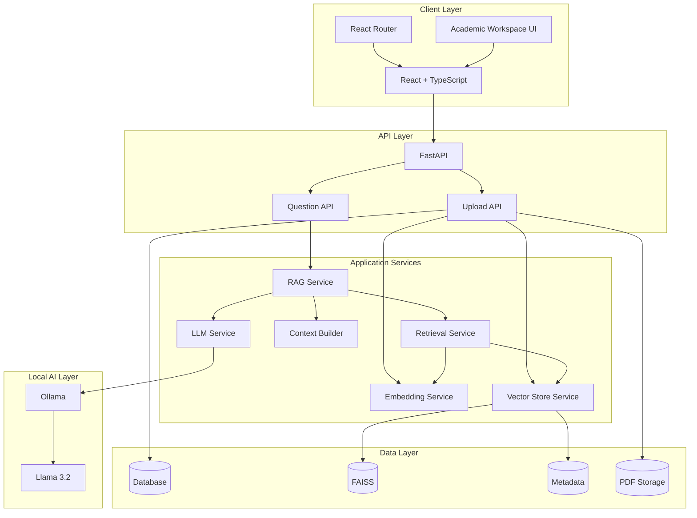

---

# Backend Architecture

The backend follows a service-oriented structure.

```text
backend/
│
├── api/
│   ├── upload.py
│   └── question.py
│
├── services/
│   ├── rag_service.py
│   ├── retrieval_service.py
│   ├── context_builder.py
│   ├── embedding_service.py
│   ├── vector_store.py
│   └── llm_service.py
│
├── models/
│   ├── notebook.py
│   └── document.py
│
├── database.py
│
└── main.py
```

---

# Backend Service Responsibilities

## Upload API

Responsible for:

* Receiving PDF files
* Validating uploaded files
* Creating document records
* Storing PDFs
* Extracting text
* Chunking
* Embedding
* Updating FAISS
* Updating document processing status

---

## Question API

Responsible for:

* Validating notebook existence
* Receiving questions
* Calling the RAG service
* Returning answers
* Returning source references
* Handling API errors

---

## RAG Service

The RAG service coordinates:

```text
Retrieval
+
Context Construction
+
LLM Generation
```

It acts as the main orchestration layer for question answering.

---

## Retrieval Service

Responsible for:

* Loading the notebook FAISS index
* Creating the question embedding
* Running similarity search
* Returning relevant chunks

---

## Context Builder

Responsible for:

* Cleaning retrieved content
* Removing duplicates
* Ordering content
* Grouping information
* Building LLM context

---

## Embedding Service

Responsible for generating vector representations for:

* Document chunks
* User questions

---

## Vector Store Service

Responsible for:

* Loading FAISS indexes
* Searching FAISS
* Saving indexes
* Loading metadata
* Validating vector/metadata alignment

---

## LLM Service

Responsible for:

* Connecting to Ollama
* Selecting Llama 3.2
* Constructing the grounded prompt
* Generating the answer
* Applying conservative output cleanup

---

# Frontend Architecture

The frontend is built with React and Vite.

Conceptual structure:

```text
frontend/
│
├── src/
│   ├── components/
│   ├── pages/
│   ├── services/
│   ├── types/
│   ├── App.tsx
│   └── main.tsx
│
├── public/
│
├── package.json
└── vite.config.ts
```

---

# Frontend Responsibilities

The frontend provides:

* Dashboard
* Notebook management
* Document management
* PDF upload
* AI chat
* Source reference display
* Settings
* Navigation
* Loading states
* Error states

---

# Database Architecture

The application database stores structured application information.

Conceptually:

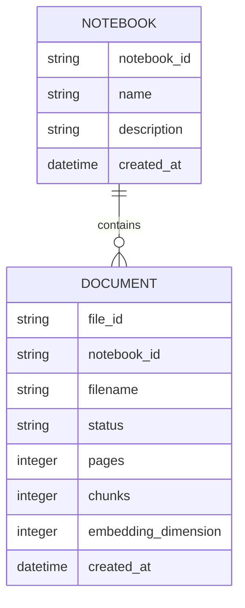

The database manages application-level metadata while FAISS manages vector similarity search.

---

# Storage Architecture

The system separates:

```text
Application Metadata
        |
        v
Database

Vector Data
        |
        v
FAISS

Source Documents
        |
        v
File Storage

Chunk Metadata
        |
        v
Metadata Storage
```

This separation keeps responsibilities clear.

---

# API Reference

## Ask Question

### Endpoint

```text
POST /api/ask
```

### Purpose

Ask a question against a specific notebook.

---

## Request

```json
{
  "notebook_id": "notebook-id",
  "question": "What are the three types of Gradient Descent mentioned in the notes?"
}
```

Optional retrieval parameter:

```json
{
  "notebook_id": "notebook-id",
  "question": "Explain stochastic gradient descent.",
  "top_k": 5
}
```

---

# API Request Validation

The question endpoint validates:

* Notebook ID
* Question presence
* Question length
* `top_k` range

The current API limits `top_k` to a valid range rather than allowing arbitrary values.

---

# API Response Structure

A successful response follows this general structure:

```json
{
  "question": "What are the three types of Gradient Descent mentioned in the notes?",
  "answer": "The notes describe Batch Gradient Descent, Stochastic Gradient Descent, and Mini-batch Gradient Descent.",
  "sources": [
    {
      "file_id": "document-id",
      "filename": "lecture.pdf",
      "page_number": 39,
      "chunk_index": 159,
      "text": "Retrieved lecture content..."
    }
  ]
}
```

The exact number of sources depends on retrieval results.

---

# HTTP Status Codes

Typical responses include:

| Status | Meaning                                    |
| ------ | ------------------------------------------ |
| 200    | Successful question processing             |
| 400    | Invalid request                            |
| 404    | Notebook or required FAISS index not found |
| 500    | Unexpected backend error                   |

---

# Environment Setup

## Prerequisites

Install the following:

* Python 3.12
* Node.js
* npm
* Git
* Ollama
* Llama 3.2

---

# Backend Setup

Create and activate the Python environment.

Example for Windows PowerShell:

```powershell
python -m venv .venv-clean
```

Activate:

```powershell
.\.venv-clean\Scripts\Activate.ps1
```

Install backend dependencies:

```powershell
pip install -r requirements.txt
```

---

# Frontend Setup

Move into the frontend directory:

```powershell
cd frontend
```

Install dependencies:

```powershell
npm install
```

---

# Ollama Setup

Install Ollama on the local machine.

Verify Ollama:

```powershell
ollama --version
```

Check installed models:

```powershell
ollama list
```

The project currently uses:

```text
llama3.2
```

If the model is not installed:

```powershell
ollama pull llama3.2
```

Test the model:

```powershell
ollama run llama3.2
```

---

# Running the Application

The frontend and backend run independently.

---

## Start Backend

From the project root:

```powershell
.\.venv-clean\Scripts\Activate.ps1
```

Then:

```powershell
python -m uvicorn backend.main:app --host 127.0.0.1 --port 8001
```

Backend:

```text
http://127.0.0.1:8001
```

FastAPI documentation:

```text
http://127.0.0.1:8001/docs
```

---

# Start Frontend

Open another terminal:

```powershell
cd frontend
npm run dev
```

Vite normally starts the frontend at:

```text
http://localhost:5173/
```

---

# Application Runtime

The complete runtime can be visualized as:

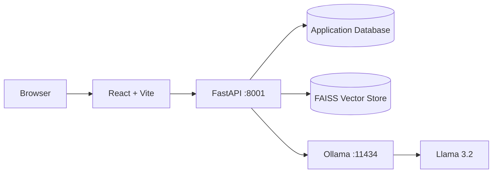

---

# Project Directory Structure

A simplified project structure:

```text
ProfessorMindAI/
│
├── backend/
│   ├── api/
│   │   ├── upload.py
│   │   └── question.py
│   │
│   ├── models/
│   │   ├── notebook.py
│   │   └── document.py
│   │
│   ├── services/
│   │   ├── context_builder.py
│   │   ├── embedding_service.py
│   │   ├── llm_service.py
│   │   ├── rag_service.py
│   │   ├── retrieval_service.py
│   │   └── vector_store.py
│   │
│   ├── database.py
│   └── main.py
│
├── frontend/
│   ├── src/
│   │   ├── components/
│   │   ├── pages/
│   │   ├── services/
│   │   ├── types/
│   │   ├── App.tsx
│   │   └── main.tsx
│   │
│   ├── package.json
│   └── vite.config.ts
│
├── storage/
│   └── notebooks/
│
├── requirements.txt
├── .gitignore
└── README.md
```

---

# Data Flow

## Document Flow


---

# Question Flow

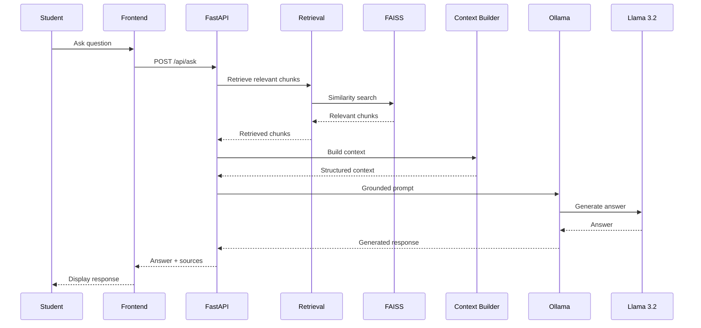

---

# Retrieval Strategy

The retrieval process is based on vector similarity.

The general flow is:

```text
Question
   |
   v
Question Embedding
   |
   v
FAISS Similarity Search
   |
   v
Candidate Chunks
   |
   v
Distance / Relevance Filtering
   |
   v
Retrieved Context
```

The goal is not simply to retrieve as many chunks as possible.

The goal is to retrieve the most useful context for answering the question.

---

# Retrieval Parameters

The question API currently supports a `top_k` parameter.

Example:

```json
{
  "notebook_id": "notebook-id",
  "question": "Explain stochastic gradient descent.",
  "top_k": 5
}
```

`top_k` controls the number of candidate chunks considered by retrieval.

A larger value can increase context coverage but may also introduce less relevant information.

A smaller value can produce more focused context but may miss useful supporting information.

Therefore, retrieval parameters should be evaluated using actual document questions.

---

# Retrieval Evaluation

Retrieval quality is evaluated separately from answer quality.

For example, a question may receive a correct answer even if the retrieval system returns some noisy chunks.

Therefore evaluation should consider:

1. Retrieved pages
2. Retrieved chunk relevance
3. Similarity distances
4. Answer correctness
5. Unsupported claims
6. Source references

---

# Retrieval Experimentation

Example evaluation questions:

```text
Q1:
What are the three types of Gradient Descent mentioned in the notes?

Q2:
What does the notes say about Stochastic Gradient Descent?

Q3:
Explain the XOR problem and its solution using a Multi-Layer Perceptron, including the example for X1 = 0 and X2 = 0.

Q4:
What is the learning rate value used for Gradient Descent in the notes?

Q5:
What is quantum computing?
```

These questions test different retrieval behaviors.

---

# Evaluation Categories

## Supported Question

The required information exists in the lecture material.

Expected behavior:

```text
Retrieve relevant chunks
        |
        v
Generate grounded answer
        |
        v
Return sources
```

---

## Unsupported Question

The required information does not exist in the uploaded notes.

Expected behavior:

```text
No sufficiently relevant evidence
        |
        v
Do not fabricate
        |
        v
Return scope/refusal response
```

---

# Testing

Testing should be performed at multiple levels.

---

## Backend Syntax Validation

Python files can be compiled without running the complete application:

```powershell
python -m py_compile backend/services/vector_store.py backend/services/context_builder.py backend/services/rag_service.py backend/services/llm_service.py
```

---

## Frontend Build

```powershell
cd frontend
npm run build
```

---

## Git Validation

```powershell
git diff --check
```

---

# Functional Testing

Important functional tests include:

### Test 1 - PDF Upload

Verify:

* PDF is accepted
* Document record is created
* Text is extracted
* Chunks are generated
* Embeddings are generated
* FAISS index is updated
* Document status becomes completed

---

### Test 2 - Supported Question

Ask a question clearly covered by the lecture notes.

Verify:

* HTTP 200
* Correct answer
* Relevant sources
* Correct filename
* Correct page references

---

### Test 3 - Unsupported Question

Ask a question outside the uploaded notes.

Verify:

* System does not fabricate an academic answer
* Response indicates insufficient scope
* Sources are empty or appropriately absent

---

### Test 4 - Notebook Isolation

Create two notebooks with different documents.

Ask a question against Notebook A.

Verify that retrieval does not use Notebook B's documents.

---

### Test 5 - Source Integrity

Verify that returned sources contain:

```text
file_id
filename
page_number
```

and that these values originate from backend retrieval metadata.

---

# Failure Handling

The backend handles common failures such as:

* Missing notebook
* Missing FAISS index
* Invalid request
* Empty question
* Invalid retrieval configuration
* Unexpected processing errors

---

# Upload Failure Handling

If document processing fails, the backend should:

1. Mark document processing as failed.
2. Log the error.
3. Avoid returning a false success state.
4. Clean up the stored source file when appropriate.
5. Return an appropriate API error.

---

# Retrieval Failure Handling

If the required FAISS index or metadata is unavailable, the system should not silently produce a fabricated answer.

The API can return a clear error indicating that documents need to be uploaded or indexed.

---

# Vector / Metadata Integrity

FAISS vector positions and metadata positions must remain aligned.

Conceptually:

```text
FAISS Position 0
       |
       +----> Metadata Position 0

FAISS Position 1
       |
       +----> Metadata Position 1

FAISS Position 2
       |
       +----> Metadata Position 2
```

If these structures become misaligned, source references may point to incorrect documents or pages.

The vector store therefore validates alignment before continuing operations where appropriate.

---

# Security Considerations

ProfessorMind AI is designed as an academic knowledge system, so security should be considered at multiple layers.

Important considerations include:

* File type validation
* Upload size limits
* Input validation
* Notebook-level isolation
* Secure authentication in production
* Authorization checks
* Safe file storage
* Protection of environment variables
* Avoiding secrets in source code
* Avoiding unnecessary external data transmission

---

# Environment Variables

Secrets and environment-specific values should not be committed to Git.

For example:

```text
.env
```

should be excluded through `.gitignore`.

Never commit:

```text
API keys
Database passwords
Authentication secrets
Private tokens
Credentials
```

---

# Privacy

The current architecture uses a local LLM through Ollama.

The intended privacy model is:

```text
Student Document
       |
       v
Local Backend
       |
       v
Local FAISS
       |
       v
Local Ollama
       |
       v
Local Llama 3.2
```

This reduces the need to send private academic documents to external LLM APIs.

Production deployments would still require careful security and access-control design.

---

# Current Implementation Status

## Implemented

* React frontend
* Vite development environment
* FastAPI backend
* Notebook-based organization
* PDF upload
* PDF text extraction
* Page-level metadata
* Text chunking
* Sentence Transformer embeddings
* FAISS vector storage
* Semantic retrieval
* RAG orchestration
* Context construction
* Local Ollama integration
* Llama 3.2 inference
* Grounded answering
* Source metadata
* Page references
* Basic unsupported-question handling
* Backend error handling
* Frontend chat interface
* Document management workflow

---

# Currently PDF-Focused

The current document ingestion implementation primarily supports:

```text
PDF
 |
 v
Text Extraction
 |
 v
Chunking
 |
 v
Embedding
 |
 v
FAISS
```

The system is architected so additional modalities can be added later.

---

# Known Limitations

## 1. PDF Text Dependency

The current ingestion pipeline primarily depends on extractable PDF text.

Scanned PDFs may require OCR.

---

## 2. Retrieval Noise

Semantic similarity does not guarantee that every retrieved chunk is perfectly relevant.

A chunk may contain related terminology without directly answering the question.

Therefore retrieval parameters require continuous evaluation.

---

## 3. Context Window

The LLM has a finite context window.

Retrieving too many chunks can introduce:

* Noise
* Redundancy
* Longer prompts
* Less focused answers

---

## 4. Answer Quality Depends on Retrieval

RAG quality can be represented conceptually as:

```text
Retrieval Quality
        +
Context Quality
        +
Prompt Quality
        +
LLM Quality
        =
Answer Quality
```

If retrieval fails, even a strong LLM may not produce the desired academic answer.

---

## 5. OCR Is Future Scope

OCR is not currently the primary implemented PDF ingestion path.

---

# Future Scope

Potential future improvements include:

* OCR for scanned PDFs
* PowerPoint ingestion
* Image understanding
* Lecture audio processing
* Video processing
* Speech-to-text
* Multimodal retrieval
* Hybrid keyword + semantic search
* Reranking
* Better citation extraction
* Authentication
* Role-based access control
* Cloud deployment
* Background document processing
* Redis caching
* Celery or task queues
* Docker deployment
* Kubernetes deployment
* Monitoring
* Evaluation dashboards
* Automated RAG benchmarks

---

# Multimodal Expansion

The project title includes multimodal learning assistance, but the current implementation is primarily PDF text-based.

A future multimodal pipeline can be:

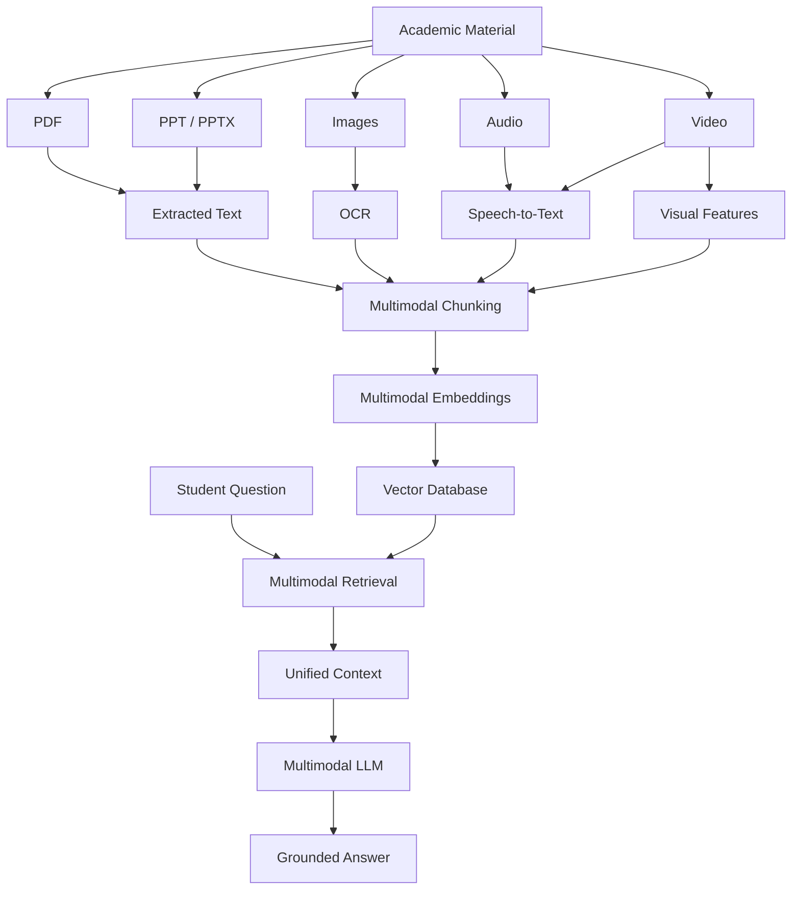

This represents future architecture rather than the current implementation.

---

# Performance Considerations

The major performance-sensitive stages are:

```text
PDF Processing
       |
       v
Embedding Generation
       |
       v
FAISS Search
       |
       v
LLM Inference
```

In many local RAG systems, LLM inference can become the largest latency component.

Performance can be improved through:

* Efficient chunking
* Appropriate embedding models
* FAISS indexing strategies
* Retrieval tuning
* Context reduction
* Prompt optimization
* GPU acceleration
* Caching
* Background processing

---

# Design Principles

ProfessorMind AI follows several engineering principles.

## 1. Grounding First

Answers should be based on retrieved academic evidence.

---

## 2. No Unnecessary Fabrication

If the notes do not provide sufficient evidence, the system should not invent academic facts.

---

## 3. Source Traceability

Retrieved information should remain connected to its source metadata.

---

## 4. Notebook Isolation

Knowledge belonging to one notebook should not unintentionally affect another notebook.

---

## 5. Modular Architecture

Services are separated according to responsibility.

---

## 6. Local-First AI

The current system uses local LLM inference through Ollama.

---

## 7. Future Extensibility

The architecture should support future multimodal and production capabilities.

---

# Why RAG?

A standard LLM has general pretrained knowledge.

However, a student's lecture material may contain:

* Professor-specific explanations
* Custom examples
* Specific terminology
* Course-specific definitions
* Specific page references
* Unique lecture content

RAG allows the system to retrieve this information before generating an answer.

Therefore:

```text
General LLM Knowledge
        +
Private Academic Knowledge
        |
        v
Grounded Academic Assistant
```

---

# Why FAISS?

FAISS is suitable for this project because it provides efficient vector similarity search.

Advantages include:

* Fast vector search
* Local execution
* Open-source ecosystem
* Python integration
* Suitable for semantic retrieval
* No mandatory external vector database

For the current project scale, FAISS provides a practical local vector search layer.

---

# Why Local LLM?

Using a local LLM provides several benefits:

* Reduced dependence on external APIs
* Better privacy control
* Offline/local experimentation
* No per-request cloud inference cost
* Easier academic experimentation

The trade-off is that local inference depends on available hardware.

---

# Why Ollama?

Ollama provides a convenient runtime for local language models.

The application can communicate with Ollama through its local API.

Architecture:

```text
FastAPI
   |
   v
Ollama
   |
   v
Llama 3.2
```

This keeps the LLM integration relatively simple and modular.

---

# Why Sentence Transformers?

Sentence Transformers are designed to produce semantic embeddings.

They are useful because:

```text
Question
   |
   v
Embedding
   |
   v
Semantic Similarity
   |
   v
Relevant Document Chunks
```

This is more appropriate for semantic retrieval than relying only on exact string matching.

---

# Advantages

ProfessorMind AI provides several advantages.

### Academic Focus

The system is specifically designed around lecture knowledge.

### Private Knowledge Retrieval

Students can query their own documents.

### Semantic Search

Conceptual similarity can be used instead of only keyword matching.

### Local AI

The current LLM inference is local.

### Source References

Retrieved pages and document metadata improve traceability.

### Modular Architecture

The system can evolve into a larger multimodal platform.

---

# Challenges

Important engineering challenges include:

## Retrieval Accuracy

Finding the right chunks is one of the most important RAG problems.

## Chunking

Chunks must contain enough information without becoming excessively large.

## Context Noise

Retrieving too much information can reduce answer quality.

## Hallucination Control

The model must remain grounded in retrieved content.

## Source Integrity

Metadata must remain correctly aligned with vectors.

## Local Inference

LLM performance depends on available CPU/GPU resources.

## Document Diversity

PDFs can have very different layouts and extraction quality.

---

# Use Cases

ProfessorMind AI can be used for:

* Lecture revision
* Exam preparation
* Concept explanation
* Quick document search
* Course-specific Q&A
* Professor-specific notes
* Academic document exploration
* Assignment preparation
* Research material exploration

---

# Academic Value

The project demonstrates the integration of several modern AI and software engineering concepts:

```text
Artificial Intelligence
        |
        +-- Natural Language Processing
        |
        +-- Embeddings
        |
        +-- Vector Search
        |
        +-- Retrieval-Augmented Generation
        |
        +-- Large Language Models
        |
        +-- Local AI
```

It also combines these concepts with:

```text
Software Engineering
        |
        +-- React
        +-- FastAPI
        +-- REST APIs
        +-- Databases
        +-- File Storage
        +-- Modular Architecture
```

---

# Engineering Value

The project is not simply an LLM chatbot.

It demonstrates a complete AI application pipeline:

```text
Frontend
   |
   v
REST API
   |
   v
Document Processing
   |
   v
Embeddings
   |
   v
Vector Database
   |
   v
Retrieval
   |
   v
Context Engineering
   |
   v
Local LLM
   |
   v
Grounded Response
```

---

# Viva Explanation

## 30-Second Explanation

ProfessorMind AI is a professor-centric academic learning assistant based on Retrieval-Augmented Generation.

Students upload lecture PDFs into notebooks. The system extracts the PDF text using PyMuPDF, divides the text into chunks, converts the chunks into embeddings using Sentence Transformers, and stores them in FAISS.

When a student asks a question, the question is converted into an embedding and searched against the relevant notebook's FAISS index.

The most relevant chunks are passed to a local Llama 3.2 model running through Ollama.

The model generates a grounded answer using the retrieved lecture material, and the system also returns source metadata such as the document name and page number.

---

# 1-Minute Technical Explanation

ProfessorMind AI follows a Retrieval-Augmented Generation architecture.

During document ingestion, a PDF is uploaded through the React frontend and sent to a FastAPI backend.

The backend extracts page-level text using PyMuPDF. The extracted content is split into chunks and converted into numerical embeddings using a Sentence Transformer model.

These embeddings are stored in a notebook-specific FAISS vector index, while document and chunk metadata are stored separately.

When the user asks a question, the question is embedded using the same embedding model. FAISS performs similarity search to identify relevant lecture chunks.

The retrieved chunks are passed through a context builder, which organizes and deduplicates the retrieved information.

The resulting context is provided to a locally running Llama 3.2 model through Ollama.

The model generates an answer based on the retrieved context.

Source metadata is returned separately so that the system can display the relevant document and page references.

---

# Common Viva Questions

## Q1. What is RAG?

RAG stands for Retrieval-Augmented Generation.

It retrieves relevant information from an external knowledge source and provides that information to an LLM before generating an answer.

---

## Q2. Why did you use RAG?

RAG allows the system to answer using private academic documents instead of relying only on the LLM's pretrained knowledge.

---

## Q3. What is FAISS?

FAISS is a library for efficient similarity search over vector embeddings.

---

## Q4. What is an embedding?

An embedding is a numerical vector representation of text that captures semantic relationships.

---

## Q5. Why use embeddings?

Embeddings allow the system to compare the semantic meaning of a question with the semantic meaning of document chunks.

---

## Q6. Why use Sentence Transformers?

Sentence Transformers provide models for converting text into semantic vector representations suitable for similarity search.

---

## Q7. Why use Llama 3.2?

Llama 3.2 provides the language-generation capability required to transform retrieved lecture context into a natural-language answer.

---

## Q8. Why use Ollama?

Ollama provides a convenient local runtime for running language models.

---

## Q9. Why not directly ask the LLM?

A direct LLM request may rely on pretrained knowledge and can hallucinate information.

RAG first retrieves relevant academic evidence.

---

## Q10. What happens if the answer is not present in the notes?

The system is designed to avoid fabricating unsupported academic information and can return an out-of-scope response.

---

## Q11. What is chunking?

Chunking divides large documents into smaller pieces that can be embedded, searched, and supplied to the LLM efficiently.

---

## Q12. What is semantic search?

Semantic search retrieves content based on meaning rather than only exact keyword matches.

---

## Q13. What is notebook isolation?

Notebook isolation means retrieval is restricted to the selected notebook's knowledge space.

---

## Q14. What is the role of FastAPI?

FastAPI provides the backend REST API connecting the frontend with document processing, retrieval, and LLM services.

---

## Q15. What is the role of React?

React provides the interactive user interface through which students upload documents and ask questions.

---

# Useful Commands

## Activate Backend Environment

```powershell
.\.venv-clean\Scripts\Activate.ps1
```

---

## Start Backend

```powershell
python -m uvicorn backend.main:app --host 127.0.0.1 --port 8001
```

---

## Start Frontend

```powershell
cd frontend
npm run dev
```

---

## Build Frontend

```powershell
cd frontend
npm run build
```

---

## Validate Python Files

```powershell
python -m py_compile backend/services/vector_store.py backend/services/context_builder.py backend/services/rag_service.py backend/services/llm_service.py
```

---

## Check Git Changes

```powershell
git status
```

---

## Check Formatting Errors

```powershell
git diff --check
```

---

## Check Ollama

```powershell
ollama list
```

---

## Run Llama 3.2

```powershell
ollama run llama3.2
```

---

# Development Workflow

Recommended development workflow:

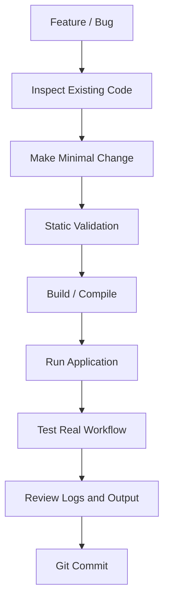

---

# Troubleshooting

## Backend Does Not Start

Check Python:

```powershell
python --version
```

Check the environment:

```powershell
.\.venv-clean\Scripts\Activate.ps1
```

Then:

```powershell
python -m uvicorn backend.main:app --host 127.0.0.1 --port 8001
```

---

# Ollama Is Not Responding

Check:

```powershell
ollama list
```

Then:

```powershell
ollama run llama3.2
```

Verify that the Ollama service is running locally.

---

# Frontend Does Not Start

Run:

```powershell
cd frontend
npm install
npm run dev
```

---

# Frontend Build Fails

Run:

```powershell
npm run build
```

Read the first actual TypeScript/Vite error instead of assuming later errors are independent.

---

# RAG Returns Poor Results

Check:

1. Whether the correct notebook is being queried.
2. Whether the PDF was successfully processed.
3. Whether FAISS contains vectors.
4. Whether metadata is aligned with vectors.
5. Whether retrieved chunks are relevant.
6. Whether `top_k` is appropriate.
7. Whether the context builder is introducing unnecessary content.
8. Whether the LLM prompt is grounded.
9. Whether the question is actually covered by the document.

---

# RAG Debugging Strategy

When an answer is wrong, do not immediately change the LLM prompt.

Debug in this order:

```text
1. Question
      |
      v
2. Query Embedding
      |
      v
3. Retrieved Chunks
      |
      v
4. Similarity Distances
      |
      v
5. Context
      |
      v
6. LLM Prompt
      |
      v
7. Generated Answer
```

This makes it easier to identify the actual failure layer.

---

# Responsible AI Considerations

ProfessorMind AI should be treated as an academic assistance system rather than an unquestionable authority.

Important considerations include:

* Answers should be checked against source material.
* Unsupported questions should not be fabricated.
* Retrieval quality should be evaluated.
* Source references should remain traceable.
* User documents should be protected.
* Production deployments should implement authentication and authorization.
* Sensitive academic documents should not be exposed unnecessarily.

---

# Future Production Architecture

A production-scale version could evolve toward:

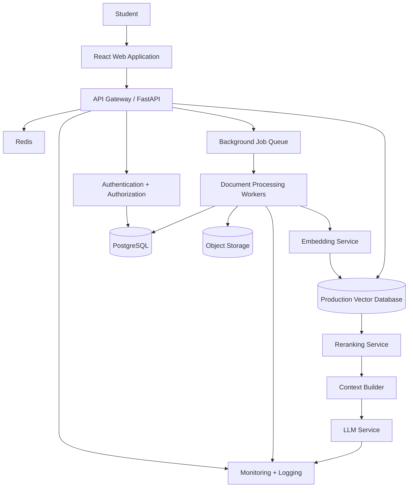

This is future architecture and is not the current deployment architecture.

---

# Potential Production Improvements

## Authentication

Users should have secure accounts.

---

## Authorization

Users should only access their own notebooks and documents.

---

## Object Storage

Uploaded documents can eventually be moved from local storage to secure object storage.

---

## Background Processing

Large documents should be processed asynchronously.

---

## Redis

Redis can be introduced for:

* Caching
* Session data
* Rate limiting
* Temporary state

---

## Reranking

A reranking model can improve retrieval quality by evaluating the relevance of initially retrieved chunks.

Potential future pipeline:

```text
FAISS Top-K
    |
    v
Reranker
    |
    v
Best Chunks
    |
    v
LLM
```

---

# Retrieval Improvement Roadmap

A future retrieval pipeline could become:

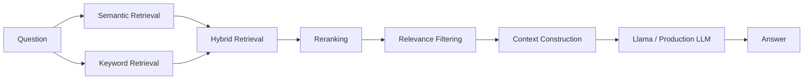

This can improve retrieval precision for academic queries containing important terminology.

---

# Engineering Principles

The project emphasizes:

```text
Correctness
   +
Traceability
   +
Modularity
   +
Privacy
   +
Maintainability
   +
Extensibility
```

A feature should not only work.

It should also be understandable, testable, and maintainable.

---

# Project Status

## Current Status

```text
Frontend              : Implemented
FastAPI Backend       : Implemented
PDF Upload            : Implemented
PDF Text Extraction   : Implemented
Chunking              : Implemented
Embeddings            : Implemented
FAISS Retrieval       : Implemented
RAG Pipeline          : Implemented
Local LLM             : Implemented
Ollama Integration    : Implemented
Source References     : Implemented
Notebook Isolation    : Implemented
Multimodal Ingestion  : Future Scope
OCR                   : Future Scope
PPT Processing        : Future Scope
Audio/Video           : Future Scope
Production Auth       : Future Scope
Cloud Deployment      : Future Scope
```

---

# Project Vision

The long-term vision of ProfessorMind AI is to evolve from a PDF-based academic chatbot into a complete private multimodal learning environment.

The future system could understand:

```text
PDF
PPT
Images
Lecture Audio
Lecture Video
Handwritten Notes
Diagrams
Tables
Assignments
Research Papers
```

and provide:

```text
Search
+
Question Answering
+
Summarization
+
Source Retrieval
+
Concept Explanation
+
Revision Assistance
+
Multimodal Knowledge Retrieval
```

---

# Final System Vision

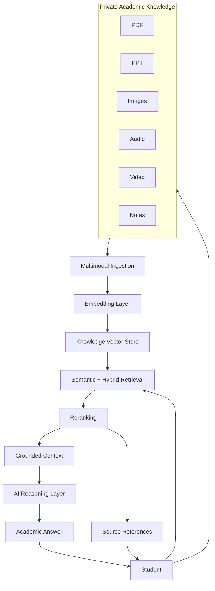

---

# Conclusion

ProfessorMind AI demonstrates how modern AI techniques can be combined with full-stack software engineering to create a private academic knowledge assistant.

The system combines:

```text
React
+
TypeScript
+
FastAPI
+
Python
+
PyMuPDF
+
Sentence Transformers
+
FAISS
+
Ollama
+
Llama 3.2
+
Database
+
RAG
```

The core architecture is intentionally modular.

The current implementation focuses on reliable PDF-based knowledge retrieval and grounded question answering.

The architecture also provides a foundation for future improvements such as OCR, multimodal document understanding, hybrid retrieval, reranking, authentication, cloud deployment, and production-scale AI infrastructure.

The central idea remains simple:

> **Upload your academic knowledge. Retrieve the right information. Generate grounded answers. Keep the knowledge private.**

---

# ProfessorMind AI

### Private Academic Knowledge. Intelligent Retrieval. Grounded Answers.

```text
PDF
 |
 v
Extract
 |
 v
Chunk
 |
 v
Embed
 |
 v
FAISS
 |
 v
Retrieve
 |
 v
Context
 |
 v
Llama 3.2
 |
 v
Answer
 |
 v
Sources
```

---

```
```
