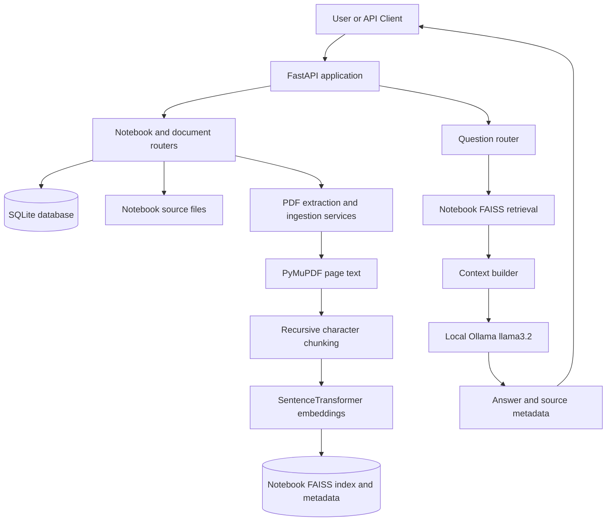
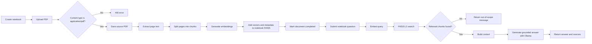
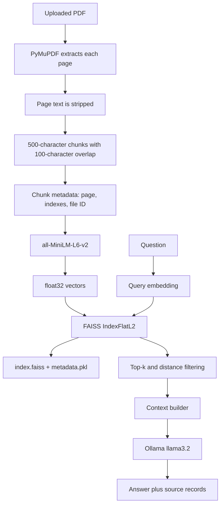

# ProfessorMind AI

> A notebook-oriented learning assistant that retrieves relevant text from uploaded lecture PDFs and uses a local Ollama model to answer questions from that material.

ProfessorMind AI is a final-year project prototype for private lecture-knowledge retrieval. The current backend lets a user create notebooks, upload text-based PDFs, extract their page text, split it into overlapping chunks, embed those chunks, store them in notebook-specific FAISS indexes, and ask grounded questions.

The repository contains a functional FastAPI backend and an early React/Vite frontend scaffold. The backend is the implemented product surface today; the frontend entry point is still the default Vite demonstration and is not connected to the API.

## Table of Contents

- [Overview](#overview)
- [Key Features](#key-features)
- [System Architecture](#system-architecture)
- [End-to-End Workflow](#end-to-end-workflow)
- [RAG Pipeline](#rag-pipeline)
- [Supported Processing](#supported-processing)
- [Question Answering](#question-answering)
- [Backend Architecture](#backend-architecture)
- [Frontend Status](#frontend-status)
- [Project Structure](#project-structure)
- [Technology Stack](#technology-stack)
- [Installation and Setup](#installation-and-setup)
- [Running the Application](#running-the-application)
- [API Reference](#api-reference)
- [Storage Architecture](#storage-architecture)
- [Testing](#testing)
- [Error Handling and Validation](#error-handling-and-validation)
- [Security and Privacy](#security-and-privacy)
- [Performance Considerations](#performance-considerations)
- [Current Status](#current-status)
- [Known Limitations](#known-limitations)
- [Future Enhancements](#future-enhancements)
- [Demo and Screenshots](#demo-and-screenshots)
- [Development Notes](#development-notes)
- [Troubleshooting](#troubleshooting)
- [AI Coding Tools](#ai-coding-tools)
- [Contributors](#contributors)
- [License](#license)

## Overview

### Problem

Lecture material is often distributed across PDF files, making it difficult to ask focused questions about a particular course or collection of notes. General-purpose chat systems can also answer beyond the supplied material, which is undesirable when the goal is to study from a professor's notes.

### Proposed solution

ProfessorMind AI organizes uploaded PDFs into notebooks. During ingestion, the backend extracts text page by page, creates chunks that retain page metadata, creates semantic embeddings, and stores the vectors in a FAISS index belonging to that notebook. A question is embedded and searched against the selected notebook. The retrieved context is sent to a local Ollama model with instructions to answer only from the uploaded lecture material.

### Target users

The implemented workflow is aimed at a student or educator working with a private collection of lecture PDFs. There is currently no authentication or multi-user account model.

## Key Features

### Notebook and document management

- Create and list notebooks.
- View one notebook and its documents.
- Upload PDF files into a notebook.
- Store uploaded files under notebook-specific source directories.
- List all documents grouped by notebook or list one notebook's documents.
- Delete an individual document and rebuild the notebook FAISS index from remaining chunks.
- Delete a notebook and its associated database records and storage directory.

### Retrieval-augmented question answering

- Extract text from PDFs with PyMuPDF.
- Preserve page numbers in extracted pages and chunks.
- Split each page with `RecursiveCharacterTextSplitter` using a 500-character chunk size and 100-character overlap.
- Generate embeddings with `sentence-transformers` using `all-MiniLM-L6-v2`.
- Store vectors in notebook-specific FAISS `IndexFlatL2` indexes.
- Retrieve up to eight chunks by default, filtering results above an L2 distance threshold of `1.2`.
- Build context from retrieved chunks and ask local Ollama model `llama3.2` for an answer.
- Return source metadata including file ID, page number, chunk index, text, and distance.
- Return a fixed out-of-scope response when no chunks pass retrieval.

### Frontend status

- A React 19 + TypeScript + Vite project is present.
- The current `App.tsx` is the generated Vite starter screen with a counter and links to Vite/React resources.
- API integration, application routes, and the planned learning-assistant screens are not implemented in the current entry point.

## System Architecture



The FastAPI application registers all routers with the `/api` prefix. SQLite stores notebook and document metadata. Original PDFs are stored on disk, while each notebook has a FAISS index and a pickle file containing the chunk metadata needed to interpret search results.

## End-to-End Workflow



## RAG Pipeline



### Ingestion and extraction

The upload endpoint accepts files only when FastAPI reports the content type as `application/pdf`. PyMuPDF opens the file and extracts `page.get_text("text")` for every page. The extracted page number and stripped text are retained. Scanned PDFs or image-only PDFs are not OCR-processed; they may produce no useful text.

### Chunking and metadata

`RecursiveCharacterTextSplitter` processes each page independently with separators `"\\n\\n"`, `"\\n"`, `". "`, `" "`, and `""`. The resulting chunks retain a global chunk index, page number, page-local chunk index, and file ID.

### Embeddings and vector storage

`SentenceTransformer("all-MiniLM-L6-v2")` encodes chunk text as NumPy arrays. The embedding dimension is obtained from the generated array and stored in the document record; it is not hard-coded in the application. FAISS uses an exact `IndexFlatL2` index. Each notebook stores `faiss/index.faiss` and `faiss/metadata.pkl` under `storage/notebooks/{notebook_id}`.

### Retrieval and context

The query is embedded with the same sentence-transformer model. The default search requests up to eight vectors and drops results with an L2 distance greater than `1.2`. The context builder joins the accepted results before the LLM call. Source records are returned to the caller, including their distance values.

## Supported Processing

The implemented ingestion path supports extractable text from PDF files. It preserves page boundaries and page numbers, but it does not implement OCR, image understanding, table extraction, audio, video, or other multimodal inputs. The project title describes a multimodal direction, while the current source code implements PDF text retrieval only.

## Question Answering

The `llm_service` sends the retrieved context and question to Ollama with a long grounding prompt. The prompt instructs the model to use only the supplied lecture material, preserve relevant PDF sequence and page references, avoid unsupported facts, and return readable Markdown. The configured model is `llama3.2` and the Ollama temperature is `0`.

The API returns the original question, the generated answer, and source objects. When no result passes retrieval, the backend returns `This question is outside the scope of the uploaded notes.` with an empty source list.

## Backend Architecture

| Component | Responsibility |
|---|---|
| `backend/main.py` | Creates database tables, configures FastAPI, registers routers, and exposes the health-style root endpoint. |
| `backend/api/notebooks.py` | Notebook creation, listing, lookup, and deletion. |
| `backend/api/upload.py` | PDF validation, persistence, ingestion, embedding, indexing, and document status updates. |
| `backend/api/documents.py` | Document listing and deletion, including FAISS rebuilding. |
| `backend/api/question.py` | Validates question requests and invokes the RAG service. |
| `backend/services/pdf_extractor.py` | Extracts text and page metadata with PyMuPDF. |
| `backend/services/text_chunker.py` | Splits page text into overlapping chunks. |
| `backend/services/embedding_service.py` | Loads and calls `all-MiniLM-L6-v2`. |
| `backend/services/vector_store.py` | Creates, saves, loads, updates, and searches FAISS indexes. |
| `backend/services/retrieval_service.py` | Embeds questions and retrieves notebook chunks. |
| `backend/services/context_builder.py` | Converts retrieved chunks into LLM context. |
| `backend/services/llm_service.py` | Calls local Ollama and returns the generated answer. |
| `backend/services/rag_service.py` | Orchestrates retrieval, context construction, generation, and sources. |
| `backend/models/*.py` | Defines SQLAlchemy `Notebook` and `Document` entities. |
| `backend/database.py` | Configures the SQLite SQLAlchemy engine and sessions. |

## Frontend Status

The frontend is a Vite scaffold using React, TypeScript, Axios, Lucide React, and React Router as declared dependencies. `main.tsx` mounts `App.tsx`, but `App.tsx` currently renders the Vite starter content. The additional component, page, hook, route, and service files in the tree are empty placeholders in the checked-in source. No frontend route table or backend API client is currently implemented.

## Project Structure

```text
ProfessorMindAI/
├── backend/
│   ├── api/
│   │   ├── documents.py
│   │   ├── notebooks.py
│   │   ├── question.py
│   │   └── upload.py
│   ├── models/
│   │   ├── document.py
│   │   └── notebook.py
│   ├── services/
│   │   ├── context_builder.py
│   │   ├── embedding_service.py
│   │   ├── llm_service.py
│   │   ├── pdf_extractor.py
│   │   ├── rag_service.py
│   │   ├── retrieval_service.py
│   │   ├── text_chunker.py
│   │   └── vector_store.py
│   ├── database.py
│   ├── main.py
│   └── test_*.py
├── frontend/
│   ├── src/
│   │   ├── App.tsx
│   │   ├── main.tsx
│   │   ├── components/
│   │   ├── pages/
│   │   ├── routes/
│   │   └── services/
│   ├── package.json
│   └── vite.config.ts
├── requirements.txt
├── .gitignore
└── README.md
```

## Technology Stack

| Category | Technology | Use in this repository |
|---|---|---|
| Backend | Python, FastAPI `0.115.6`, Uvicorn `0.34.0` | HTTP API and local development server. |
| Database | SQLite, SQLAlchemy `2.0.41` | Notebook and document metadata. |
| PDF processing | PyMuPDF `1.28.2` | Page-level text extraction. |
| Chunking | LangChain text splitter | Recursive character chunking. |
| Embeddings | Sentence Transformers `5.7.0` | `all-MiniLM-L6-v2` embeddings. |
| Vector search | FAISS CPU `1.15.0` | Notebook-local exact L2 search. |
| LLM runtime | Ollama, model `llama3.2` | Local answer generation. |
| Frontend | React `19.2.8`, TypeScript `6.0.2`, Vite `8.3.0` | Current frontend scaffold. |
| Frontend libraries | Axios, React Router, Lucide React | Declared dependencies; not yet wired into the current app screen. |

The requirements file contains a broad Python environment, but the application paths documented above use the packages listed in the backend imports. `ollama` is imported by `backend/services/llm_service.py` but is not currently pinned in `requirements.txt`.

## Installation and Setup

### Prerequisites

- Python compatible with the installed dependencies.
- Node.js and npm for the frontend scaffold.
- Ollama installed and running locally.
- The Ollama `llama3.2` model available locally before asking questions.
- A machine capable of installing FAISS CPU and the sentence-transformer dependencies.

### Clone and install the backend

From the repository root in Windows PowerShell:

```powershell
python -m venv venv
.\venv\Scripts\Activate.ps1
python -m pip install --upgrade pip
pip install -r requirements.txt
```

Because `ollama` is imported but absent from `requirements.txt`, install the Ollama Python client separately if it is not already present in the environment:

```powershell
pip install ollama
```

Start Ollama and obtain the configured model using the Ollama installation's normal workflow. The application expects the model name `llama3.2`; no API key or `.env` variable is read by the current backend.

### Install the frontend

```powershell
cd frontend
npm install
```

The checked-in `frontend/.env.example` is empty, and no frontend environment variable is currently consumed by the source.

## Running the Application

### Terminal 1: backend

From the repository root with the virtual environment active:

```powershell
uvicorn backend.main:app --reload
```

The default Uvicorn address is `http://127.0.0.1:8000`. FastAPI's interactive documentation is available at `http://127.0.0.1:8000/docs` when the server is running.

The first backend import creates `professormind.db` in the working directory and creates `storage/notebooks` as needed.

### Terminal 2: frontend scaffold

```powershell
cd frontend
npm run dev
```

Vite prints the actual local URL when it starts, usually `http://localhost:5173`. The current page is the starter Vite screen and does not call the backend.

## API Reference

All router endpoints below are mounted beneath `/api`.

| Method | Endpoint | Request | Purpose |
|---|---|---|---|
| `POST` | `/api/notebooks` | JSON: `{ "name": string, "description": string\|null }` | Create a notebook and its `sources` and `faiss` directories. |
| `GET` | `/api/notebooks` | None | List notebooks with document metadata. |
| `GET` | `/api/notebooks/{notebook_id}` | Path ID | Return one notebook and its documents. |
| `DELETE` | `/api/notebooks/{notebook_id}` | Path ID | Delete a notebook, its document records, and notebook storage. |
| `POST` | `/api/notebooks/{notebook_id}/upload-pdf` | Multipart file field `file` | Validate, save, extract, chunk, embed, and index one PDF. |
| `GET` | `/api/documents` | None | List all notebooks with their documents. |
| `GET` | `/api/notebooks/{notebook_id}/documents` | Path ID | List documents in one notebook. |
| `DELETE` | `/api/notebooks/{notebook_id}/documents/{file_id}` | Path IDs | Delete a document and rebuild or remove the notebook index. |
| `POST` | `/api/ask` | JSON: `{ "notebook_id": string, "question": string, "top_k": number }` | Retrieve notebook context and generate an answer. `top_k` defaults to `8`. |
| `GET` | `/` | None | Return `{ "message": "ProfessorMind AI Backend Running" }`. |

Successful upload responses include file ID, original and stored filenames, page and chunk counts, embedding dimension, FAISS vector count, notebook chunk count, and document status. Successful question responses include `question`, `answer`, and `sources`. Error responses are raised as FastAPI HTTP errors; the exact detail is produced by the relevant route.

Example question request:

```powershell
curl.exe -X POST http://127.0.0.1:8000/api/ask `
  -H "Content-Type: application/json" `
  -d '{"notebook_id":"<notebook-id>","question":"What is described in the notes?","top_k":8}'
```

## Storage Architecture

```mermaid
flowchart TD
	A[professormind.db] --> B[Notebook rows]
	A --> C[Document rows]
	D[storage/notebooks/{id}/sources] --> E[Stored PDFs]
	F[storage/notebooks/{id}/faiss] --> G[index.faiss]
	F --> H[metadata.pkl]
	B -. notebook_id .-> D
	C -. file_id and metadata .-> E
	C -. chunk and embedding counts .-> F
```

The `Notebook` entity contains `notebook_id`, `name`, `description`, and `created_at`. The `Document` entity contains file identity, notebook association, original/stored filename, page and chunk counts, embedding dimension, status, error message, and upload time. The root `.gitignore` excludes local virtual environments, database files, uploaded storage, and generated vector stores.

## Testing

The repository contains six Python scripts named as tests:

| File | Intended coverage |
|---|---|
| `backend/test_extractor.py` | PDF page extraction. |
| `backend/test_chunker.py` | PDF extraction followed by chunking. |
| `backend/test_embeddings.py` | Extraction, chunking, and embedding generation. |
| `backend/test_vector_store.py` | FAISS creation and persistence. |
| `backend/test_retrieval.py` | Retrieval from a stored index. |
| `backend/test_rag.py` | End-to-end answer generation and sources. |

These are executable scripts, not `pytest` test functions. Several still reference a sample file under `storage/pdfs`, pass a `file_id` to notebook-based functions, or call old helper names such as `save_faiss_index`. They require updating and suitable sample data before they can be treated as reliable automated regression tests. No coverage percentage is claimed.

## Error Handling and Validation

- Uploads reject non-PDF content types with HTTP 400.
- Missing notebooks and documents return HTTP 404 in the relevant routes.
- Failed ingestion marks the document as `failed`, stores the exception text, removes the failed PDF, and returns HTTP 500.
- Missing or empty FAISS indexes produce an empty retrieval result.
- The question route maps a missing FAISS index to HTTP 404 and unexpected errors to HTTP 500.
- Pydantic validates notebook creation and question request shapes.
- The frontend currently has no application-level API error handling because it is not connected to the backend.

## Security and Privacy

Implemented privacy-related behavior is local storage of PDFs, SQLite metadata, notebook-specific indexes, and local Ollama inference. The repository ignores `.env`, database files, uploaded storage, and generated vector files.

Authentication, authorization, user isolation, request-size limits, malware scanning, rate limiting, HTTPS, and production secret management are not implemented. The API should therefore be treated as a local development prototype, not as a deployed multi-user service.

## Performance Considerations

The implementation uses local sentence-transformer inference, exact FAISS `IndexFlatL2` search, page-wise chunking, and notebook-specific indexes. Retrieval limits the requested results to `top_k` and avoids asking FAISS for more vectors than the index contains. There is no caching, batching policy, asynchronous ingestion worker, streaming response, or approximate nearest-neighbor index configuration.

Potential improvements include background ingestion, configurable model and retrieval settings, persistent model lifecycle management, approximate FAISS indexes for larger collections, response streaming, and measured evaluation of retrieval quality.

## Current Status

### Implemented

- FastAPI application and API routing.
- SQLite SQLAlchemy metadata models.
- Notebook creation, listing, lookup, and deletion.
- PDF upload with page extraction and failure status tracking.
- Chunking, sentence-transformer embeddings, FAISS persistence, and filtered retrieval.
- Local Ollama-based grounded question answering with source records.
- React/Vite project scaffold and package scripts.

### Planned or incomplete in the current source

- A connected React learning-assistant interface.
- Frontend routing, API client, notebooks UI, upload UI, document UI, and chat UI.
- OCR and genuinely multimodal document processing.
- Automated, maintained regression tests.
- Authentication and multi-user support.

## Known Limitations

- Only PDF uploads are accepted, and extraction is text-based; scanned PDFs are not OCR-enabled.
- The backend depends on a local Ollama installation and the `llama3.2` model.
- `ollama` is missing from the pinned requirements file.
- Storage and database paths are local relative paths.
- No authentication or authorization is present.
- The frontend is still the Vite starter screen.
- Existing test scripts contain stale file-based assumptions and are not currently a dependable test suite.
- The backend does not expose a configurable environment-based database URL or model setting.

## Future Enhancements

Possible next steps, clearly outside the current implementation, include:

- Connect the React application to the documented API.
- Add OCR and image/table extraction for scanned lecture material.
- Add authentication, authorization, and per-user notebook isolation.
- Add conversation history and streaming answers.
- Improve citations and source display in the UI.
- Add retrieval and answer evaluation datasets.
- Add integration tests for upload, deletion, retrieval, and question flows.
- Move from local storage to a production storage and vector-service architecture when scale requires it.

## Demo and Screenshots

No demo URL, video, or repository screenshots are currently provided. The local backend can be explored through FastAPI's `/docs` page after startup; the frontend currently shows the Vite starter interface.

## Development Notes

- Run backend commands from the repository root so the `backend` package imports and relative storage paths resolve as intended.
- Notebook creation initializes `storage/notebooks/{notebook_id}/sources` and `storage/notebooks/{notebook_id}/faiss`.
- The first import of `backend.main` creates database tables automatically with `Base.metadata.create_all(bind=engine)`.
- Deleting a document regenerates the notebook index from the remaining chunks.
- Deleting a notebook removes both database records and its notebook storage directory.

## Troubleshooting

### PowerShell cannot activate the virtual environment

Use a shell policy that permits locally created scripts, or run the environment's Python executable directly. The repository does not provide a custom activation script.

### Backend import or startup errors

Confirm that commands are run from the repository root, the virtual environment is active, and `pip install -r requirements.txt` completed. If the error names `ollama`, install the Python client separately and ensure the Ollama service is running.

### Question requests fail

Create a notebook and upload a text-extractable PDF first. Confirm that `storage/notebooks/{notebook_id}/faiss/index.faiss` and `metadata.pkl` exist, and verify that Ollama has the `llama3.2` model available.

### PDF processing returns no useful text

The extractor uses PyMuPDF text extraction only. Image-only or scanned PDFs need OCR support, which is not part of the current implementation.

### Frontend does not show application features

This is expected for the current source: `frontend/src/App.tsx` is still the Vite starter application and is not connected to the FastAPI backend.

## AI Coding Tools

AI coding tool usage is not currently documented in the repository.

## Contributors

Contributor or project-team information is not currently specified in the repository.

## License

No license file or license declaration is currently present in the repository.

## Conclusion

ProfessorMind AI currently provides a local, notebook-scoped RAG backend for asking questions over extractable text in private lecture PDFs. Its ingestion, retrieval, FAISS persistence, and Ollama answer-generation paths are implemented, while the React interface, production security, multimodal processing, and maintained automated tests remain future work.
